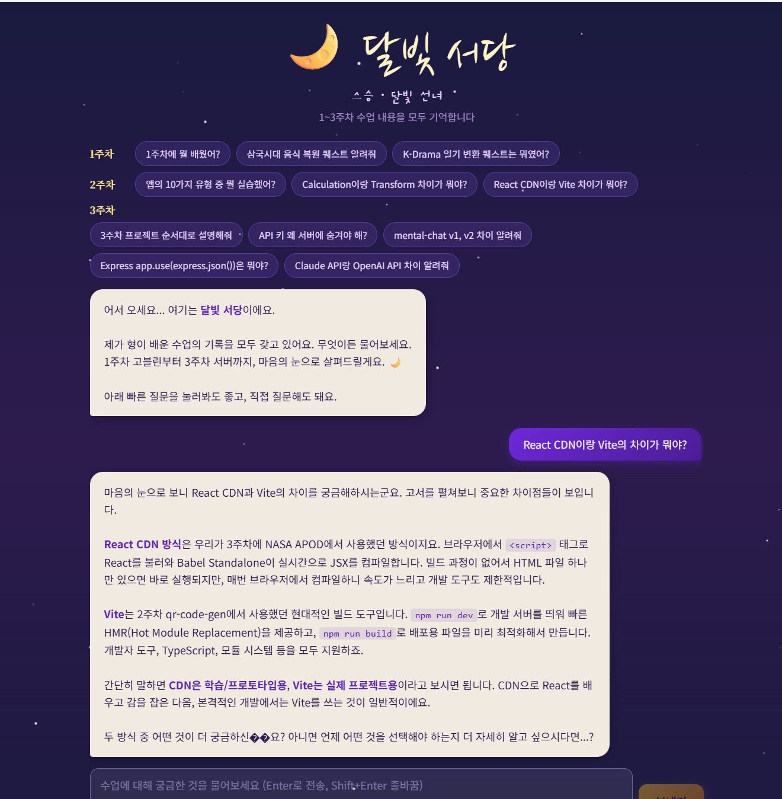
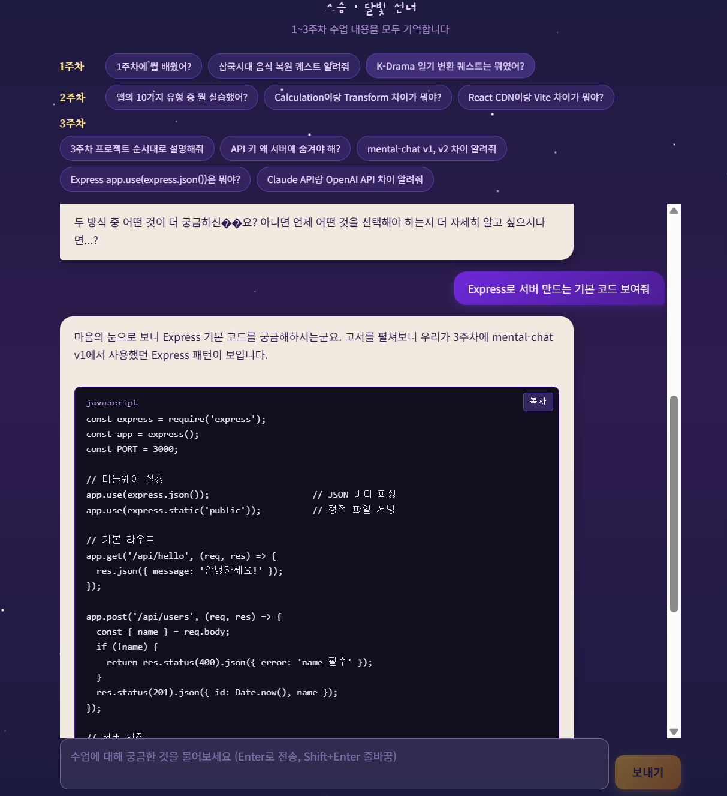
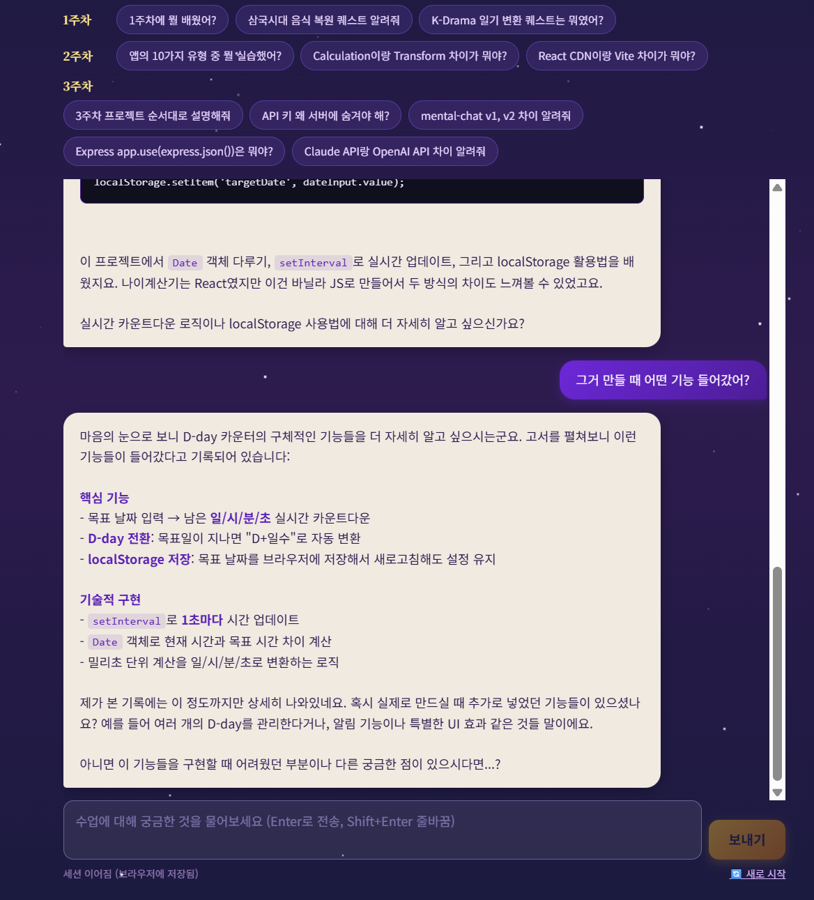

# 🌙 달빛 서당 — AI 수업 질문 에이전트

harbor.school AI 수업 1~3주차 내용을 모두 기억하는 **달빛 선녀**가 질문에 답해드립니다. 세션 메모리로 이전 대화 맥락까지 이어가는 학습 도우미.

## ⚠️ 실행 전 필수 설정

이 프로젝트는 **Anthropic Claude API 키**가 필요합니다.

### 1단계 — API 키 발급

1. https://console.anthropic.com/settings/keys 접속
2. **Create Key** 클릭 → 키 복사 (`sk-ant-api03-...` 형식)

### 2단계 — 환경 변수 설정

```bash
cp .env.example .env
```

그 후 `.env` 파일을 열어 API 키 입력:

```
ANTHROPIC_API_KEY=sk-ant-api03-xxxxx
```

### 3단계 — 실행

```bash
node server.js
```

브라우저에서 http://localhost:3000 접속.

> 별도의 `npm install`은 필요 없습니다. Node 내장 모듈만 사용합니다.

## 🎯 주요 기능

- 📚 **수업 전체 컨텍스트** — `context/*.md` 4개 파일(약 2만 자)을 시스템 프롬프트로 주입
- 💬 **세션 메모리** — localStorage + 서버 인메모리로 이전 대화 맥락 유지
- 🎭 **달빛 선녀 페르소나** — 따뜻한 무당 스타일 학문 스승
- 🔘 **빠른 질문 버튼** — 1주차/2주차/3주차별 대표 질문
- 💻 **코드 블록 렌더링** — 답변에 포함된 코드를 자동 하이라이트 + 복사 버튼
- 🧹 **자동 세션 정리** — 1시간 미사용 세션 자동 제거
- 🔄 **새로 시작** — 세션 리셋 (localStorage + 서버 동시)

## 🛠️ 기술 스택

- **Node.js** (내장 `http`, `https` 모듈, Express 없이)
- **Anthropic Claude API** (`claude-sonnet-4-20250514`)
- **React 18 CDN** + **Babel Standalone** + **Tailwind CDN**
- 자체 `.env` 파서 (dotenv 미사용)

## 📸 동작 화면

### 텍스트 질문


### 코드 질문


### 메모리 기능


## 📂 프로젝트 구조

```
study-agent/
├── server.js              # http 서버 + 컨텍스트 로더 + 세션 관리
├── index.html             # 달빛 서당 React UI
├── .env.example           # API 키 템플릿
├── .gitignore
├── README.md
├── screenshots/           # 동작 화면 캡처 보관
└── context/
    ├── week1.md           # 1주차 — 개발 환경 + 에이전트 퀘스트
    ├── week2.md           # 2주차 — 웹 앱 구조 + 계산기/변환기
    ├── week3.md           # 3주차 — 서버 + AI API 연동
    └── code-examples.md   # 수업 실습 코드 9가지 패턴
```

## 💡 사용 팁

- **빠른 질문 버튼**으로 시작하면 감을 잡기 쉽습니다.
- "아까 물어본 거랑 연결해줘" 같은 **이어지는 질문**도 가능 — 세션 메모리가 작동합니다.
- 자료에 없는 내용(예: 4주차 계획)은 달빛 선녀가 "제가 본 기록에는 없네요"라고 솔직히 답합니다.

## ⚠️ 주의사항

- `.env` 파일은 절대 GitHub에 올리지 마세요 (API 키 노출 위험).
- 세션은 **인메모리**라 서버 재시작 시 소실됩니다.
- 컨텍스트가 길어서 대화마다 토큰이 꽤 소비됩니다. 긴 대화는 비용에 유의.
- 학습용 프로젝트입니다.

## 📝 라이선스

MIT
