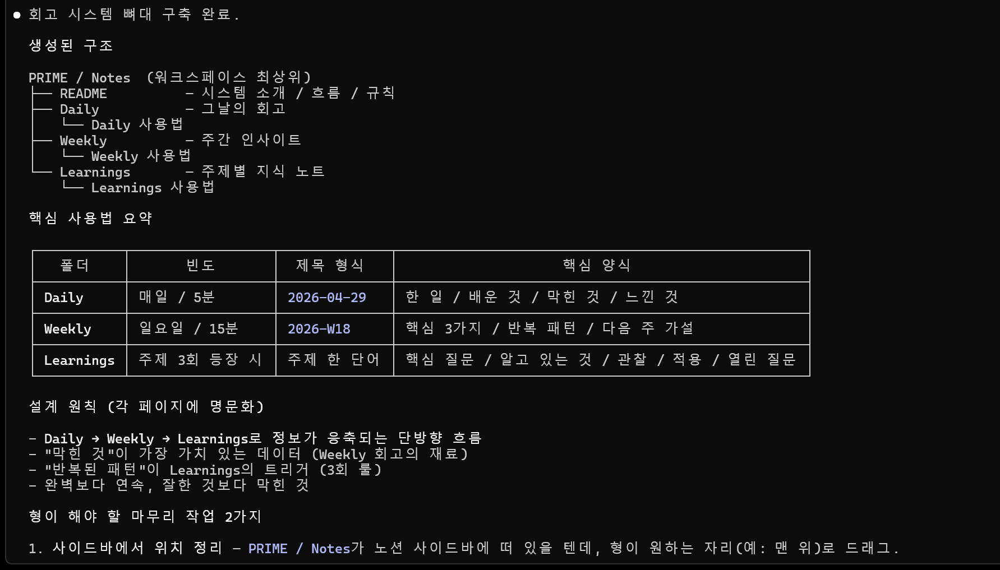
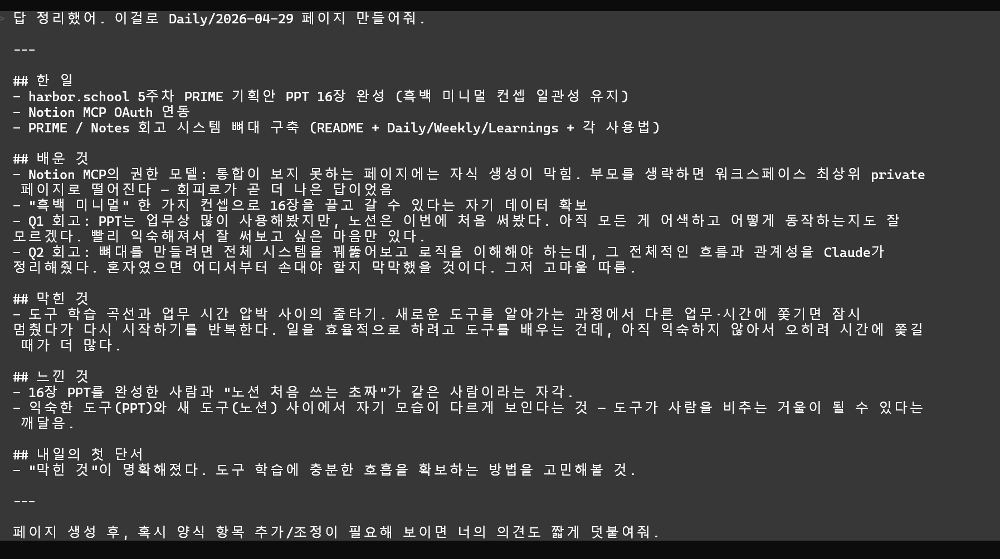

# Q1 — PRIME / Notes — Reflect

회고와 학습 기록을 누적하는 개인 노션 시스템 구축.

## 컨셉

**Reflect** = 흩어지는 정보를 한 곳에 모으고, 그 안에서 패턴을 찾는 도구.

- Daily — 매일의 짧은 회고 (5분)
- Weekly — 한 주를 펼쳐놓고 패턴 찾기 (15분)
- Learnings — 반복되는 주제를 주제별로 응축

흐름은 단방향: **Daily → Weekly → Learnings**.

## 작업 내역 (2026-04-29)

### 1. Notion MCP OAuth 셋업

```
claude mcp add --transport http notion https://mcp.notion.com/mcp
```

OAuth 흐름으로 워크스페이스 권한 위임. 이후 Claude Code에서 노션 페이지 직접 조회·생성·수정 가능.

### 2. 워크스페이스 정찰

기존 노션 상태 진단:

| 카테고리 | 비율 |
|---|---|
| 레시피 (week4quest DB) | ~70% |
| 노션 기본 템플릿 잔존물 | ~19% |
| 테스트/빈 페이지 | ~8% |
| 회의록·일기·학습·메모 | **0%** |

→ 회고 데이터를 0부터 쌓을 수 있는 깨끗한 출발 상태 확인.

### 3. 회고 시스템 뼈대 구축

```
PRIME / Notes  (워크스페이스 최상위)
├── README          시스템 소개 / 흐름 / 규칙 / 진화 로그
├── Daily           매일의 회고
│   └── Daily 사용법
├── Weekly          주간 인사이트
│   └── Weekly 사용법
└── Learnings       주제별 지식 노트
    └── Learnings 사용법
```

### 4. Daily 양식 (5항목)

```
## 한 일
## 배운 것       ← 외부 사실 (기술·도구·정보)
## 막힌 것       ← 주간 회고의 재료
## 느낀 것       ← 자기 자신에 대한 발견
## 내일의 첫 단서 ← 오늘 → 내일을 잇는 신호
```

### 5. 자기 진화 (4 → 5항목)

첫 회고(`2026-04-29`) 작성 직후, "내일의 첫 단서" 항목이 사용자 손에서 자연 발생.
비서 제안으로 정식 양식에 편입. **시스템 1회 진화 완료.**

README의 `진화 로그` 섹션에 기록:
> 2026-04-29 — 첫 회고 1번 만에 양식이 4항목 → 5항목으로 진화함 (내일의 첫 단서 추가)

## 설계 원칙

1. 짧게 쓴다. 한 줄도 충분하다.
2. 솔직하게 쓴다. 잘한 것보다 막힌 것이 더 가치있다.
3. 매일 쓴다. 완벽보다 연속이 중요하다.

## 다음 단서 (2026-04-30 시작점)

> "도구 학습에 충분한 호흡을 확보하는 방법을 고민해볼 것."

도구를 효율을 위해 배우지만, 익숙하지 않은 동안엔 오히려 시간 압박을 만든다는 자각이 첫 단서.

## 스크린샷

### 1. 워크스페이스 정찰 — 진단 결과


### 2. 시스템 뼈대 구축 완료


### 3. 첫 회고 작성 + 비서의 깊이 질문


### 4. 자기 진화 — 양식 4항목 → 5항목 (보너스)


### 5. 노션 워크스페이스 실물 (옵션)

