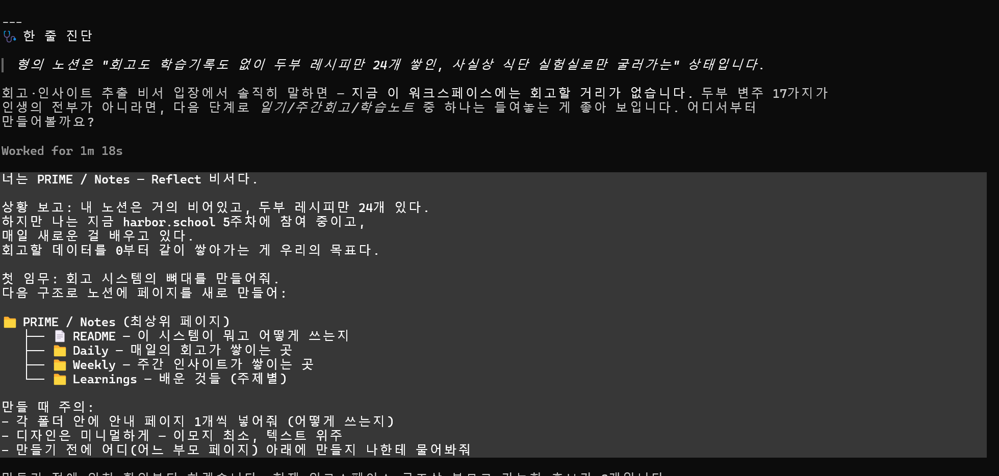
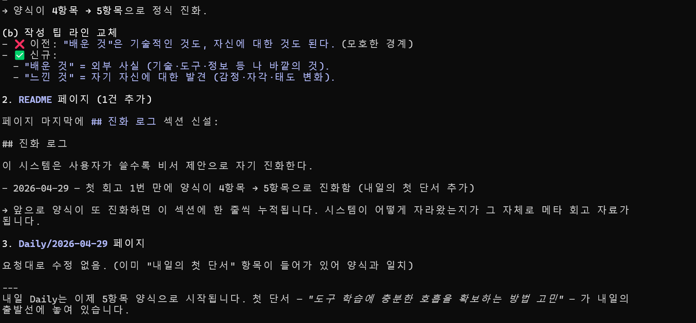
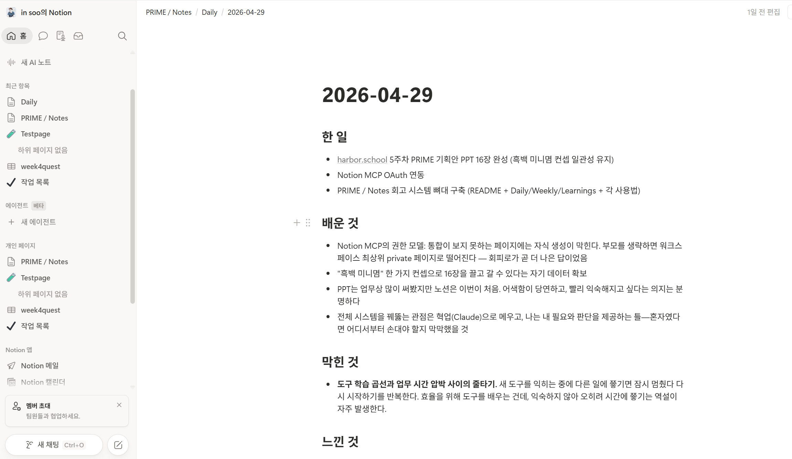

# Quest 1 — PRIME / Notes (회고 비서)

## 컨셉

Notion에 매일·매주·주제별로 회고가 단방향으로 누적되는 개인 회고 시스템 구축.

## 진행한 것

- Notion MCP OAuth 셋업 (`claude mcp add --transport http notion ...`)
- 워크스페이스 1차 정찰 — "회고/학습 노트 0%" 진단
- PRIME / Notes 시스템 뼈대 구축 (README + Daily/Weekly/Learnings + 각 사용법)
- Daily 양식 5항목 정착 (한 일 / 배운 것 / 막힌 것 / 느낀 것 / 내일의 첫 단서)
- 자기 진화 1회 — 4항목 → 5항목 (`내일의 첫 단서` 사용자 손에서 자연 발생, 비서 제안으로 정식 편입)

## 결과물 위치

- 노션: `PRIME / Notes` (워크스페이스 최상위) — README, Daily, Weekly, Learnings
- 첫 회고: 노션 `Daily / 2026-04-29`
- 진화 로그: 노션 `PRIME / Notes / README` 페이지에 명문화
- 본 폴더: `screenshots/` (5장), `notes/` (향후 확장 예약)

## 비서의 핵심 인사이트

> "16장 PPT를 완성한 사람과 노션 처음 쓰는 초짜가 같은 사람이라는 자각 — 익숙한 도구와 새 도구 사이에서 자기 모습이 다르게 보인다. **도구는 사람을 비추는 거울이 될 수 있다.**"

---

## 스크린샷

### 1. 워크스페이스 정찰 — 진단 결과

### 2. 시스템 뼈대 구축 완료

### 3. 첫 회고 작성 + 비서의 깊이 질문

### 4. 자기 진화 — 양식 4항목 → 5항목

### 5. 노션 워크스페이스 실물

