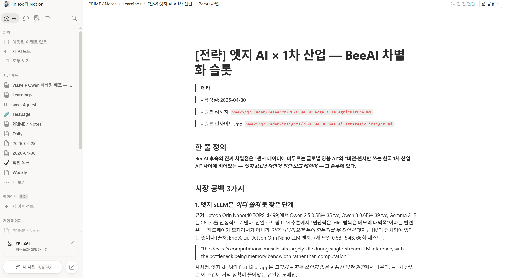
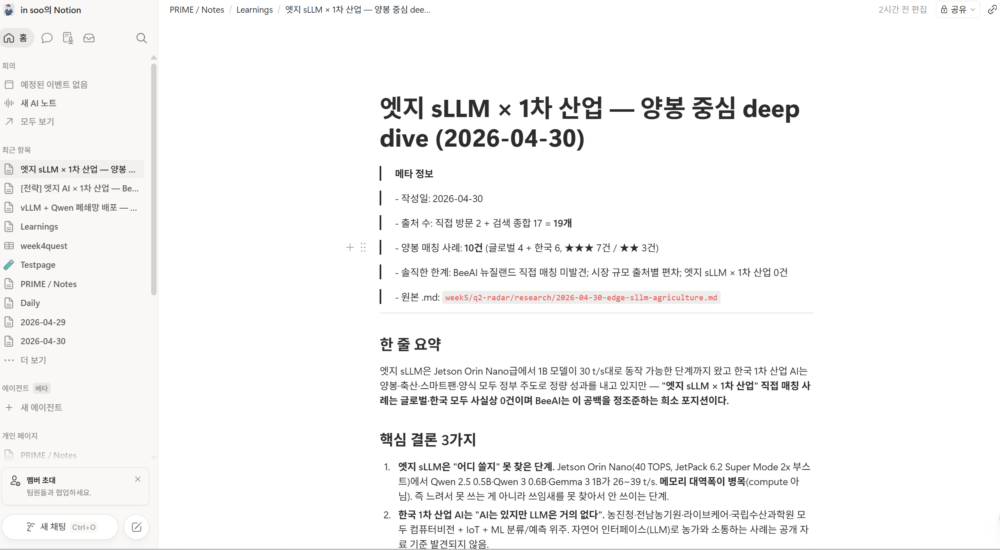
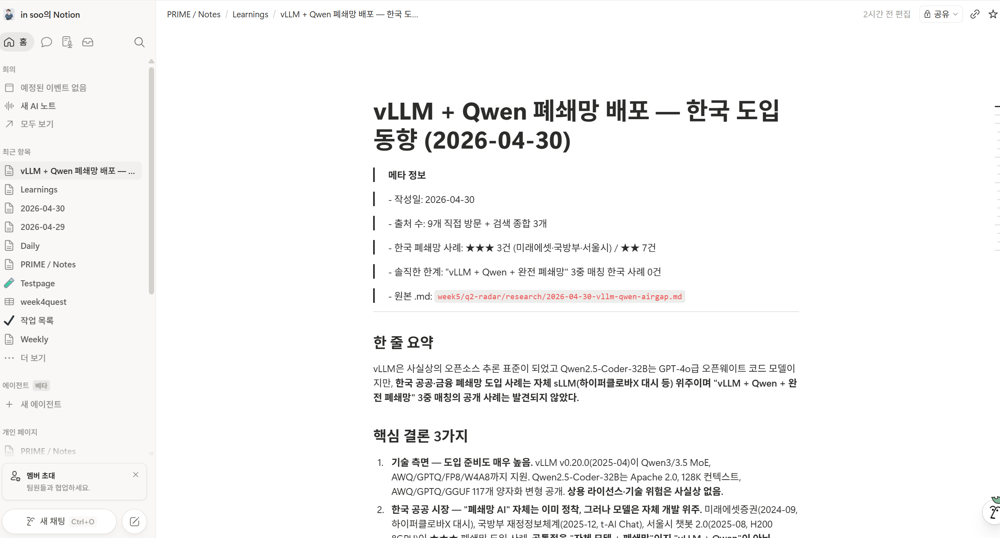
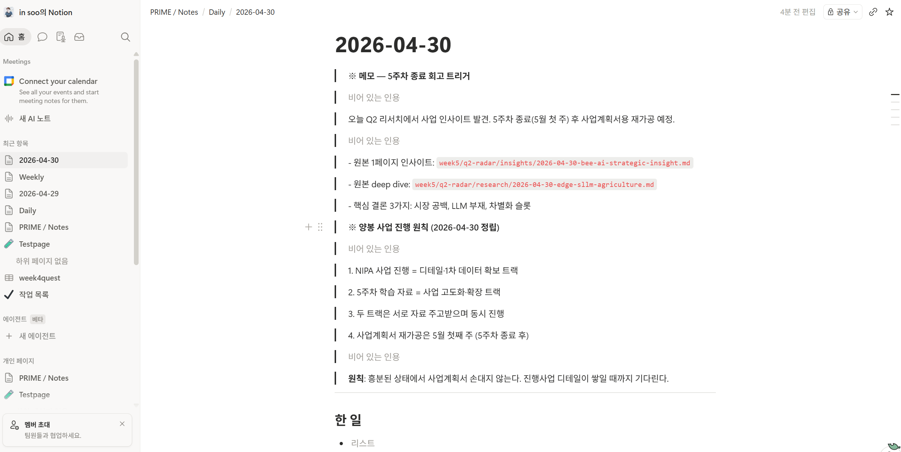
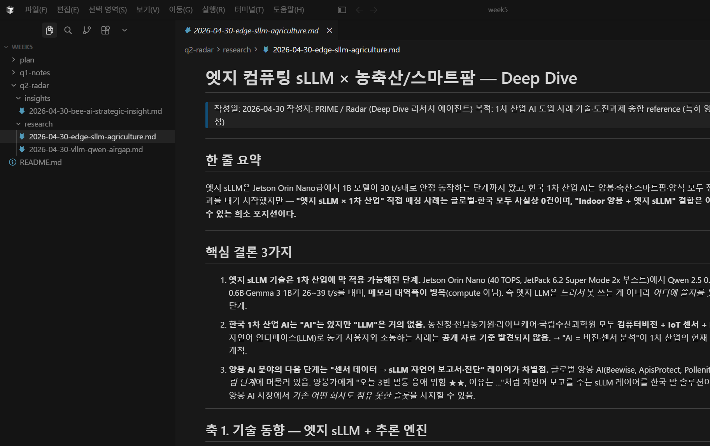

# Quest 2 — PRIME / Radar (Deep Dive 리서치 비서)

## 컨셉

한 주제를 던지면 비서가 5~10개 1차 출처를 직접 방문해 4축 구조로 정리한 .md 리포트를 만드는 deep dive 리서치 에이전트. 시장 공백 탐지 + 솔직한 한계 명시.

## 진행한 것

- Playwright MCP 셋업 (`npx @playwright/mcp@latest`)
- 1차 리서치: **vLLM + Qwen2.5-Coder 폐쇄망 배포** — 한국 ★★★ 사례 3건 발굴 (미래에셋·국방부·서울시)
- 2차 리서치: **엣지 sLLM × 농축산/스마트팜** — 양봉 ★ 매칭 10건 (글로벌 4 + 한국 6)
- 1페이지 전략 인사이트 별도 추출 — 양봉 AI 차별화 슬롯 정의
- 노션 `PRIME / Notes / Learnings`에 3페이지 자동 업로드 + Daily 메모 트리거 등록

## 결과물 위치

- `research/2026-04-30-vllm-qwen-airgap.md` — 폐쇄망 LLM Deep Dive (9개 1차 출처)
- `research/2026-04-30-edge-sllm-agriculture.md` — 엣지 sLLM × 농축산 (19개 출처, 양봉 ★ 10건)
- `insights/2026-04-30-bee-ai-strategic-insight.md` — 1페이지 전략 인사이트
- 노션: `PRIME / Notes / Learnings` 3페이지 + `Daily / 2026-04-30` 트리거 메모
- 본 폴더: `screenshots/` (5장)

## 비서의 핵심 인사이트

> "엣지 sLLM은 *느려서* 못 쓰는 게 아니라 *어디 쓸지* 못 찾은 단계 — 메모리 대역폭이 병목이지 compute는 idle. 한국 1차 산업은 'AI는 있지만 LLM은 없다'. **양봉 AI 분야의 *센서 → sLLM 자연어 진단·보고 레이어*는 글로벌·국내 모두 0건의 정확한 시장 공백.**"

---

## 스크린샷

### 1. 1페이지 전략 인사이트

### 2. 양봉 AI 글로벌·한국 매칭 표

### 3. vLLM 폐쇄망 한국 도입 사례 (★★★ 3건)

### 4. Daily 2026-04-30 트리거 메모

### 5. 결과물 폴더 트리

