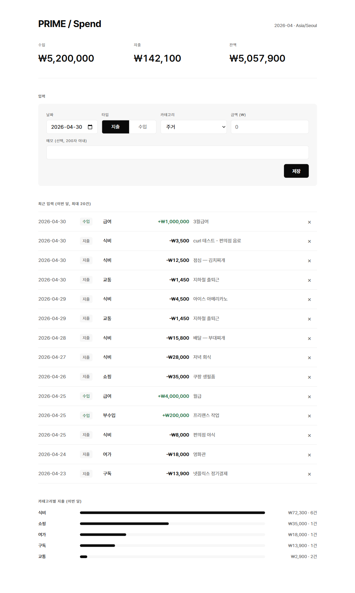
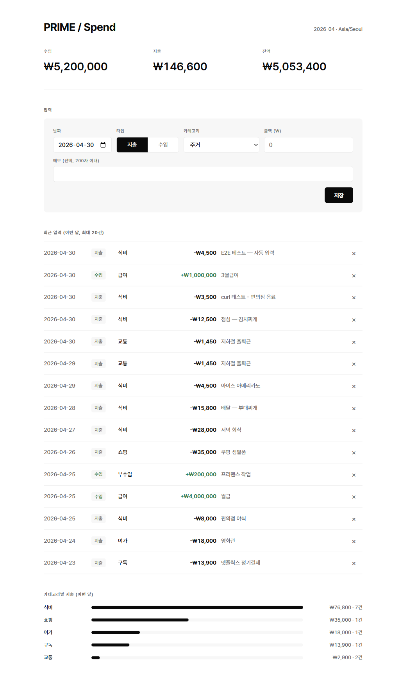
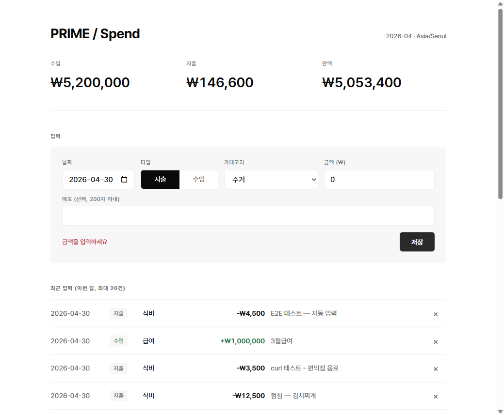
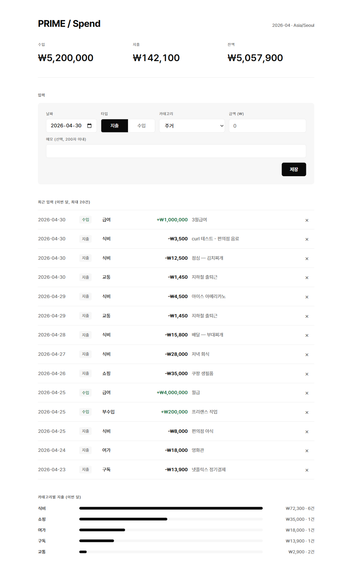
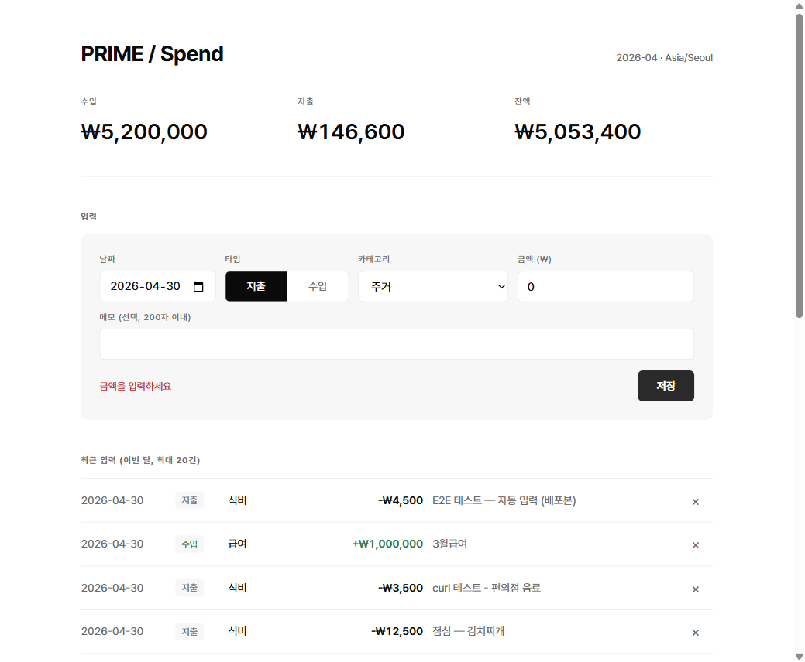
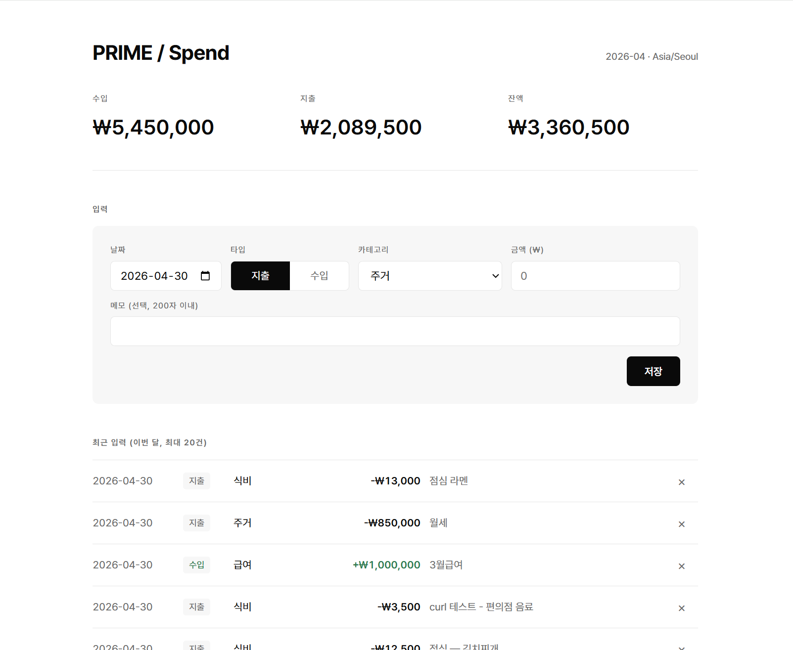
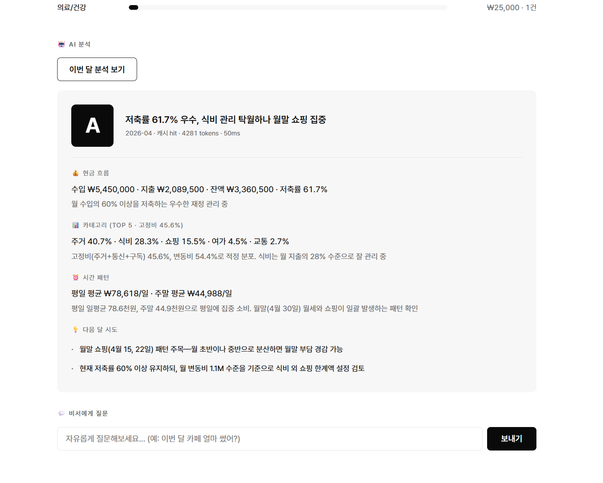
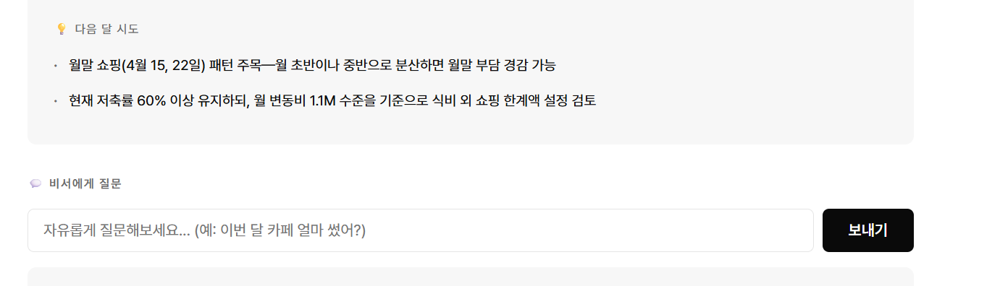
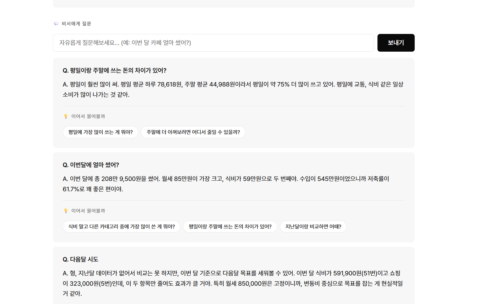

# Quest 3 — PRIME / Spend + Insight (가계부 + AI 분석 통합)

> 🔗 **Production**: https://harbor-school-mmake7-3440s-projects.vercel.app/
> 📁 **레포**: `week5/quest3-budget-app/`
> 🤖 **Q4 통합**: monthly 리포트 + chat 대화형 (Step D)

## 컨셉

수입·지출을 한 줄 입력 → 카테고리별 자동 추적 + 월별 통계, KST 시간대 일관.
4주차 `life_*` 8개 지출 카테고리를 재활용해 5주차 ↔ 4주차 데이터 호환성 확보.
**Q4 (PRIME / Insight)**: 같은 화면에서 Claude 분석 — 등급·4축 리포트·자유 질문.

## 진행한 것

- **DB 스키마 v2** — `app.budget_categories`(type=expense/income), `app.entries`(통합 입력) + 트리거(updated_at)
- **시드 16 카테고리** — 지출 12개(housing/food/transport/telecom/subscription/shopping/pet/leisure/health/education/saving/etc) + 수입 4개(salary/side/allowance/other)
- **Vercel 함수 1개** (`api/budget.js`, 255줄) — `?view=` 분기로 categories / entries(GET·POST·PATCH·DELETE) / stats / budget-vs-actual 모두 흡수 (Vercel 12함수 한도 룰 준수)
- **KST 일관 헬퍼** (`lib/datetime.js`) — 모든 "오늘", "이번 달" 기준은 UTC+9 직접 계산. DB는 UTC, API 응답은 KST 명시
- **흑백 미니멀 SPA** (`public/index.html`, 461줄, vanilla JS) — Pretendard CDN 1개 외 라이브러리 0
- **로컬 + 배포 양쪽에서 Playwright E2E 5/5 PASS** — 로딩 / 입력 / 검증 실패 / 삭제 / 영속성
- **Vercel 배포** (GitHub 연동 자동 배포)

## 결과물 위치

| 항목 | 경로 |
|---|---|
| 스키마·시드 | `sql/schema.sql`, `sql/seed.sql` |
| API | `api/budget.js` |
| KST 헬퍼 | `lib/datetime.js` |
| UI (1파일 SPA) | `public/index.html` |
| DB 적용·검증 | `scripts/apply.js`, `scripts/test-conn.js` |
| 로컬 dev 서버 | `dev-server.js` (Express wrapper) |
| Vercel 배포 설정 | `vercel.json`, `.vercelignore` |
| E2E 스크린샷 | `test-screenshots/` (로컬 5장 + 배포 5장) |

## 실행 방법 — 로컬 vs 배포

### 로컬 실행

```bash
cd week5/quest3-budget-app
npm install
# .env.local 에 DATABASE_URL 작성 (4주차 .env.local 재활용 가능)
node scripts/apply.js   # schema → seed → 검증
node dev-server.js      # http://localhost:3000
```

### Production 배포 (Vercel)

- **URL**: https://harbor-school-mmake7-3440s-projects.vercel.app/
- **방식**: GitHub `mmake7/harbor-school` repo 연동 → Root Directory `week5/quest3-budget-app` → 자동 배포 (push to main)
- **환경변수 2개** (Vercel 프로젝트 Settings → Environment Variables):
  - `DATABASE_URL` — Supabase pooler 연결 (4주차에서 그대로)
  - `ANTHROPIC_API_KEY` — Claude API (Q4 분석)
- **함수 정의**: `vercel.json`의 `functions: { "api/budget.js" / "api/analyze.js": { "maxDuration": 10 } }`

## API 엔드포인트

### Q3 — 가계부 (`/api/budget`)

| Method | Path | 설명 |
|---|---|---|
| GET | `?view=categories` | 카테고리 마스터 (지출 12 + 수입 4) |
| GET | `?view=entries[&month=YYYY-MM]` | 월별 입력 조회 (기본: 이번 달 KST) |
| POST | `?view=entries` | 입력 추가 `{entry_date, type, category_id, amount, memo}` |
| PATCH | `?view=entries&id=...` | 입력 수정 |
| DELETE | `?view=entries&id=...` | 입력 삭제 |
| GET | `?view=stats` | 이번 달 합계 / 카테고리별 / top 3 |
| GET | `?view=budget-vs-actual` | 카테고리 평균(직전 3개월) vs 이번 달 실적 |

### Q4 — AI 분석 (`/api/analyze`)

| Method | Path | 설명 |
|---|---|---|
| GET | `?view=monthly[&month=YYYY-MM]` | 월간 리포트 (등급 + 4축 분석, DB 캐시 + Claude) |
| POST | `?view=cache-clear[&month=...]` | 월간 리포트 캐시 삭제 (개발용) |
| POST | `?view=chat` body `{question, month?}` | 자유 질문 → 데이터 기반 답변 + 후속 질문 |

## 자동 검증 결과

### Playwright E2E — 로컬 (`localhost:3000`) 5/5 ✅

| # | 시나리오 | 결과 | 스크린샷 |
|---|---|---|---|
| 1 | 페이지 로딩 검증 | ✅ PASS | `test-screenshots/e2e-01-initial-load.png` |
| 2 | 신규 입력 (식비 4,500 + 메모) | ✅ PASS (헤더·리스트·막대 모두 +4,500) | `e2e-02-after-create.png` |
| 3 | 검증 실패 (금액 0) | ✅ PASS (인라인 에러, 데이터 변동 0) | `e2e-03-validation-error.png` |
| 4 | 삭제 (confirm dialog) | ✅ PASS (baseline 복귀) | `e2e-04-after-delete.png` |
| 5 | 새로고침 후 영속성 | ✅ PASS (서버 DB가 진실의 원천) | `e2e-05-after-reload.png` |

### Playwright E2E — 배포본 (`harbor-school-mmake7-3440s-projects.vercel.app`) 5/5 ✅

| # | 시나리오 | 결과 | 스크린샷 |
|---|---|---|---|
| 1 | 페이지 로딩 (Production) | ✅ PASS (HTTP 200, KST 라벨 정상) | `test-screenshots/deployed-01-initial-load.png` |
| 2 | 신규 입력 (메모 "배포본") | ✅ PASS | `deployed-02-after-create.png` |
| 3 | 검증 실패 | ✅ PASS | `deployed-03-validation-error.png` |
| 4 | 삭제 (confirm dialog) | ✅ PASS | `deployed-04-after-delete.png` |
| 5 | 새로고침 후 영속성 | ✅ PASS | `deployed-05-after-reload.png` |

→ **로컬 ↔ Production 동등 동작 확인.** 동일 코드, 동일 DB(Supabase pooler), 다른 호스트 환경에서 5 시나리오 모두 일관 결과.

## 비서의 핵심 인사이트

> **"가계부의 진실의 원천은 DB이지 화면이 아니다."**
>
> KST/UTC 시간대 처리에서 가장 미묘했던 결정은 *어느 레이어에서 변환할지*. 답: **API 레이어 1군데에서만 KST 변환**, DB는 UTC, UI는 그대로 받아쓴다. 중간에 한 번이라도 변환하면 어디선가 1일이 어긋난다.
>
> localStorage·sessionStorage 0 사용을 강제했더니, 새로고침 후에도 같은 데이터가 보이는 *데이터 영속성*과 POST/DELETE 직후 즉시 반영되는 *데이터 무결성*이 자연스럽게 분리 검증됐다 — 시나리오 4·5가 정확히 이 분리를 짚어냄.
>
> 배포 단계에서는 두 가지 비코드 함정이 더 있었다 — Vercel 자동 *Authentication 보호*가 기본 켜져있어 SSO 벽에 막힘 / DATABASE_URL 환경변수 미등록 시 `pg`가 localhost:5432로 fallback해서 ECONNREFUSED. **둘 다 코드 버그 아니라 인프라 설정**, 한 번씩 마주치고 나면 다음부터 반사적으로 체크하게 된다.

---

## 폴더 구조 (Q3 자동화 증거 + Q4 제출용)

```
test-screenshots/
├── e2e-01~05-*.png          ← Q3 로컬 (localhost:3000) Playwright 자동 캡처
└── deployed-01~05-*.png     ← Q3 배포본 (Vercel) Playwright 자동 캡처

screenshots/q4/
├── 01-overview.png          ← Q4 메인 화면 (가계부 + 분석 섹션 통합)
├── 02-monthly-report.png    ← Q4 월간 리포트 카드 (등급 + 4축)
├── 03-advice.png            ← Q4 다음 달 시도 (advice 섹션)
└── 04-chat.png              ← Q4 대화형 답변 (Q + A + 후속 질문)
```

---

## 스크린샷 갤러리

### 로컬 (E2E 5단계)

#### 1. 초기 로드


#### 2. 신규 입력 직후


#### 3. 검증 실패


#### 4. 삭제 후


#### 5. 새로고침 후


### 배포본 (Production)

#### 1. 초기 로드 (Production)


#### 2. 신규 입력 직후 (Production)


#### 3. 검증 실패 (Production)


#### 4. 삭제 후 (Production)


#### 5. 새로고침 후 (Production)


### Q4 — AI 분석 (제출용)

#### 1. 메인 화면 — 가계부 + AI 분석 섹션 통합


#### 2. 월간 리포트 카드 (등급 + 4축 분석)


#### 3. 다음 달 시도 (advice)


#### 4. 대화형 비서 (질문 + 답변 + 후속 질문)

