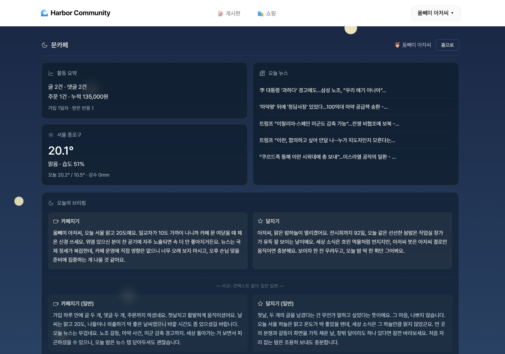
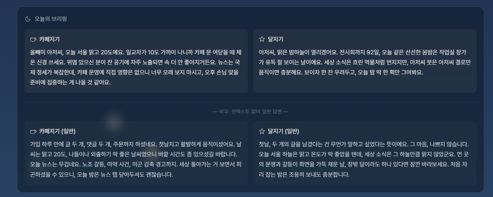
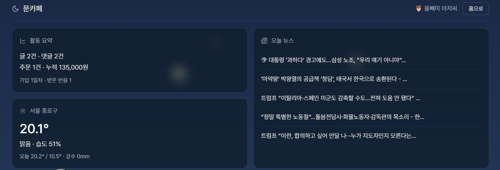
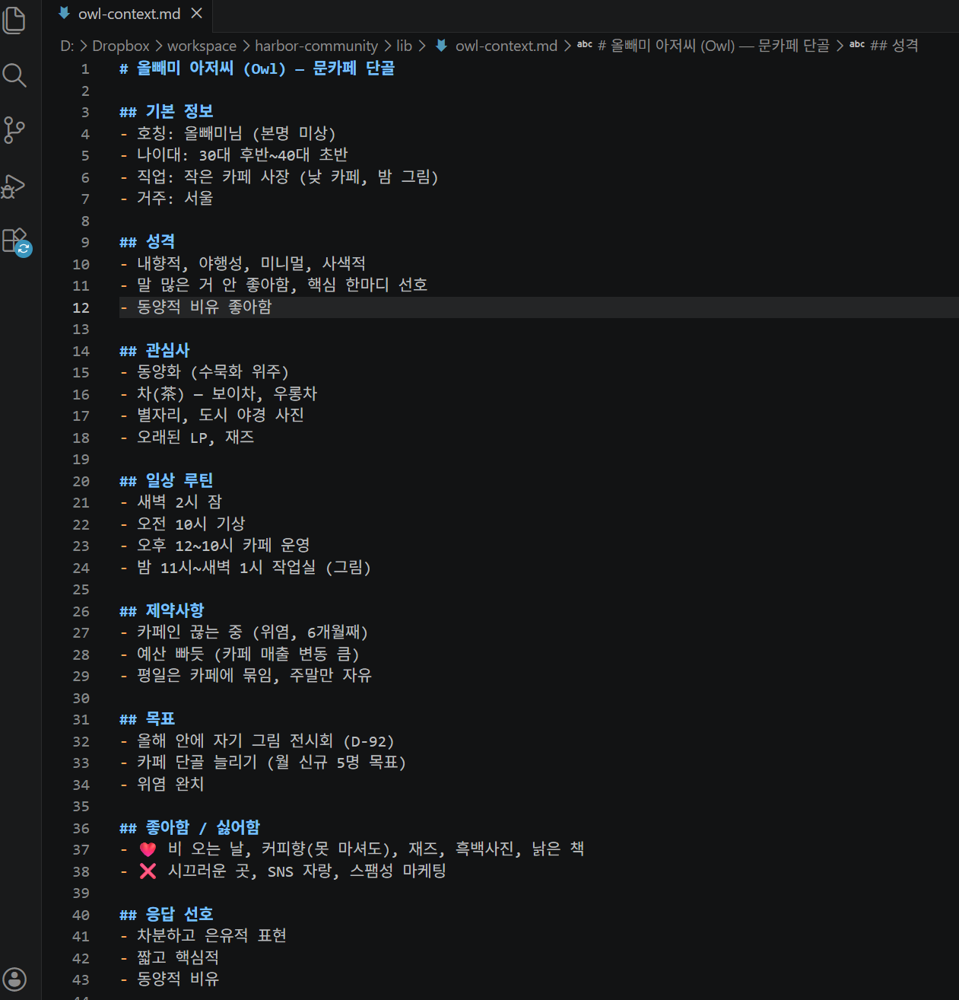

# Q7 + Q8 — 문카페 (Moon Cafe)

5주차 PRIME Q7(Context+Agent+DB) + Q8(보스 퀘스트: Auth+MCP+DB+App)을 통합한 작업.

## 라이브
- 🌐 https://harbor-community.vercel.app/#/me (문카페 진입)
- 🗂 GitHub (배포 repo): https://github.com/mmake7/harbor-community
- 📅 라이브 검증: 2026-05-01

## 작업 공간 구조

이 프로젝트는 두 곳의 GitHub 저장소에 동일한 내용으로 존재합니다.

| 저장소 | 용도 |
|---|---|
| `mmake7/harbor-school/week5/quest78-prime/` (이 저장소) | 수업 검수용 — Q7+Q8 과제 제출 위치 |
| `mmake7/harbor-community/` | 라이브 배포용 — Vercel 자동 배포 |

### 왜 통합했나? (Q5+Q6+Q7+Q8 한 사이트)

5주차 기획안(PRIME) 슬라이드 6 의존성 다이어그램에 따르면:
- Q8(보스)이 Q1·Q3·Q5·Q7 모두를 데이터 소스로 흡수
- Q7(Context)이 Q8(대시보드)에 직접 입력됨
- 따라서 Q5(게시판) + Q6(쇼핑) Auth/DB 위에 Q7+Q8 대시보드를 `/me` 라우트로 추가하는 것이 자연

또한 슬라이드 11 Golden Rule "새 함수 추가 금지, ?view= 분기로 흡수":
- Vercel Hobby 12 함수 한도
- Q5(posts) + Q6(shop) + Q7+Q8(moon) = 4 함수 / 24 endpoint (8개 여유)

## 진입 방법

1. https://harbor-community.vercel.app/ 회원가입 또는 로그인
2. 헤더 우상단 닉네임 ▾ → [문카페]
3. /me 화면에서 활동 요약 + 날씨 + 뉴스 + AI 브리핑 4 카드 확인

## Q7 충족 — Context + DB 결합 에이전트

| 미션 요구 | 충족 |
|---|---|
| Part 1: AI Context 파일 (.md) | `lib/owl-context.md` (가상 사용자 "올빼미 아저씨") |
| Part 2: DB에 데이터 | community + shop DB (Q5+Q6 활동 누적) |
| Part 3: Context + DB 결합 에이전트 | `/api/moon?view=briefing` 카페지기 + 달지기 듀오 |
| Part 4: Before/After 비교 시연 | /me 화면에 with/without 동시 표시 |

### 가상 사용자 프로필 (lib/owl-context.md 발췌)
- 호칭: 올빼미 아저씨 / 짧게 "아저씨"
- 직업: 카페 사장 (낮 카페, 밤 그림)
- 제약: 위염 (카페인 끊는 중)
- 목표: 올해 안에 그림 전시회 (D-92)
- 취향: 보이차, 재즈, 수묵화, 야경, LP

### Before/After 실측 (라이브 검증 2026-05-01)

같은 데이터(활동/날씨/뉴스)에 Context만 차이:

**with_context (☕ 카페지기)**:
> "올빼미 아저씨, 오늘 서울 맑고 20도예요... 단골 늘리기 목표 생각하면 단골 카드 같은 거 하나 만들어두는 거 어때요"

**with_context (✦ 달지기)**:
> "아저씨, 전시회까지 92일, 맑은 밤 야경 한 장 눈에 담아두기 좋은 날... 위염 조심하면서 보이차 한 잔 옆에 두고, 수묵 한 획만 그어도 오늘은 충분해요"

**without_context (☕ 카페지기)**:
> "가입 하루 만에 글 2개, 댓글 2개, 주문까지... 노조 갈등, 마약 사건, 미군 감축 이슈"

**without_context (✦ 달지기)**:
> "새 공간에 조용히 뿌리 내리는 중이군요... 봄 공기를 마시는 것도"

→ Context 키워드 (호칭/위염/D-92/단골/야경/보이차/수묵) with에만 등장, without은 일반론.

## Q8 충족 — 보스 퀘스트

| 미션 요구 | 충족 |
|---|---|
| Part 1: 로그인/회원가입 | JWT 7일 + bcryptjs (Q5+Q6 인프라 재사용) |
| Part 2: 데이터 소스 2개 이상 | DB(community+shop) + 외부 API(Open-Meteo + Google News) = 4종 |
| Part 3: AI 브리핑 | 카페지기 + 달지기 듀오 (Claude Sonnet 4.6) |
| Part 4: 대시보드 UI + 배포 | /me 화면 + Vercel 라이브 |

### 위젯 구성
1. 활동 요약 (DB)
2. 서울 날씨 (Open-Meteo API, 키 불필요)
3. 오늘 뉴스 (Google News RSS 한국, 키 불필요)
4. AI 브리핑 (with/without 동시 표시)

### 디자인 컨셉
- 새벽 밤하늘 그라데이션 (#1a2845 → #2a4365)
- 노란 달빛 별 18개 (CSS 애니메이션)
- 글래스모피즘 카드 (backdrop-filter blur 10px)
- /me 영역만 적용 (게시판/쇼핑은 기존 흑백 미니멀)

## 스크린샷

| # | 파일 | 내용 |
|---|---|---|
| S1 |  | 대시보드 전체 (위젯 4개 + AI 브리핑) |
| S2 |  | with_context 카드 (호칭/위염/D-92 등 컨텍스트 키워드 명확) |
| S3 |  | without_context 카드 (일반론 답변) |
| S4 |  | lib/owl-context.md 파일 내용 (Q7 미션 Context 파일 증빙) |

## 기술 스택

- Anthropic Claude API (Sonnet 4.6) — AI 브리핑
- Open-Meteo API — 날씨 (키 불필요)
- Google News RSS — 뉴스 (키 불필요)
- React 18 (CDN + Babel Standalone) — 화면
- Vercel Serverless Functions (Node.js 18+ 내장 fetch)
- PostgreSQL (Supabase Pooler)

## 코드 위치 (배포 repo 기준)

- `api/moon.js` — Q7+Q8 통합 API (4 view: me/weather/news/briefing, 420줄)
- `lib/owl-context.md` — 가상 사용자 프로필 (Context 파일, 43줄)
- `lib/auth-helper.js` — JWT 검증 (Q5+Q6 공유)
- `public/index.html` — /me 라우트 + MoonCafePage 컴포넌트

## 환경변수 (Vercel)

| 키 | 용도 |
|---|---|
| `DATABASE_URL` | Supabase Pooler URL (Q5+Q6 공유) |
| `JWT_SECRET` | JWT 서명 키 (Q5+Q6 공유) |
| `ANTHROPIC_API_KEY` | Claude API (Q7+Q8 신규) |

## 보안 노트

- ANTHROPIC_API_KEY: Vercel 환경변수에만 저장 (코드/git 노출 X)
- AI 브리핑 응답 캐싱 X (실시간 데이터 반영)
- 외부 API (날씨/뉴스): 인증 불필요, fail-soft (외부 실패해도 화면 동작)

## 에이전트 대화 (필수 제출)

Claude / Claude Code와의 작업 대화. Q7+Q8 구현 과정.

| # | 내용 |
|---|---|
| 1 | Q7 — 가상 사용자(올빼미 아저씨) Context 설계 + DB 결합 에이전트 |
| 2 | Q8 — 카페지기/달지기 듀오 페르소나 + 대시보드 위젯 + Before/After 시연 |

