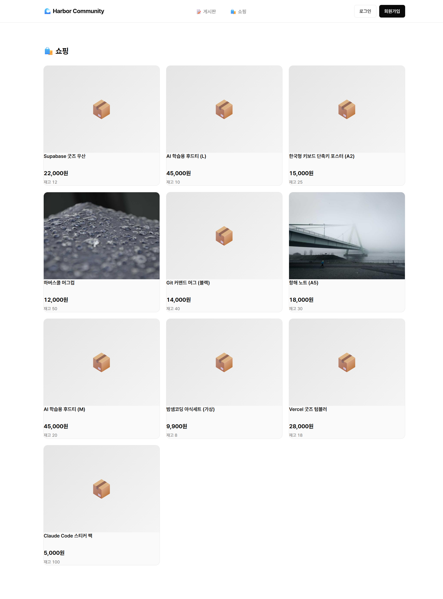
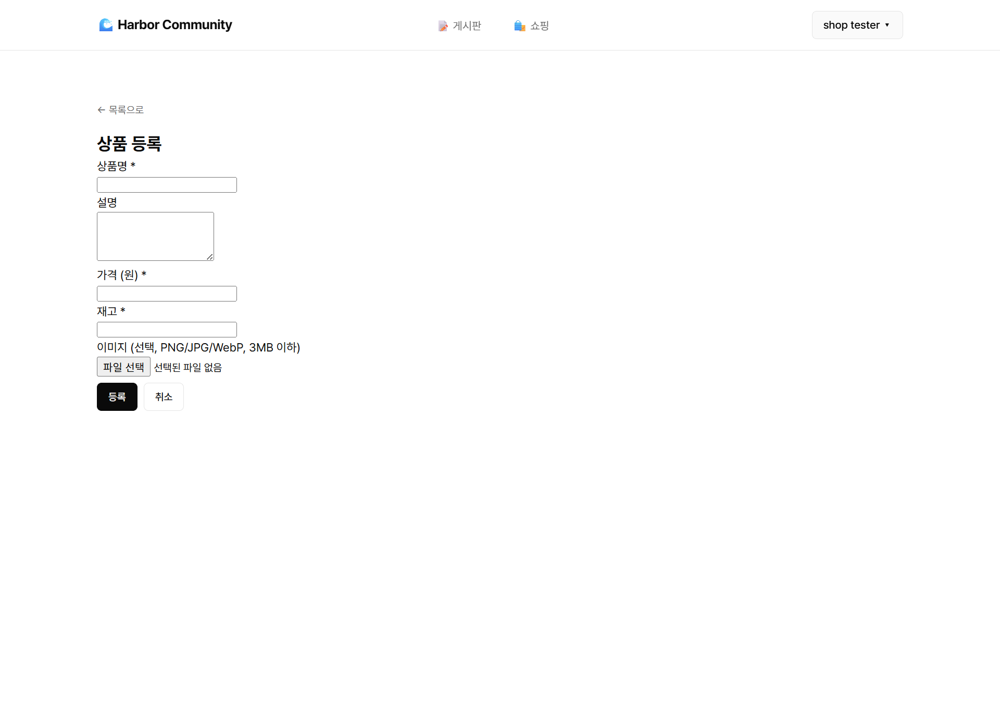
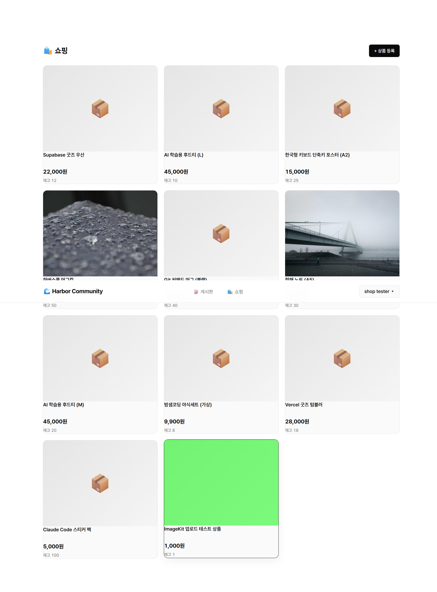
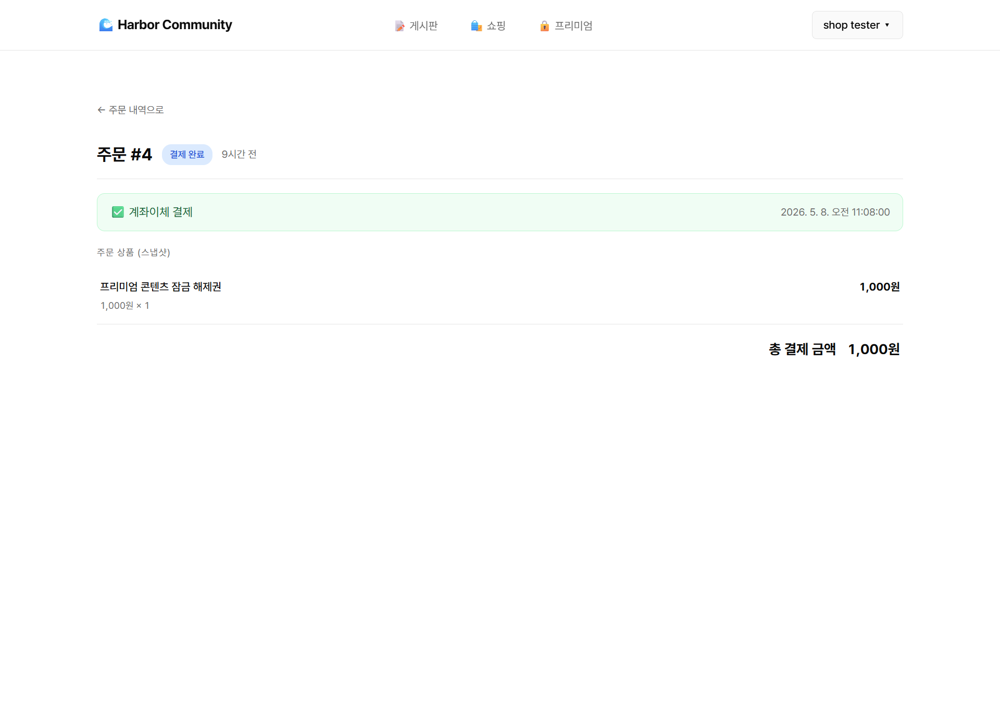
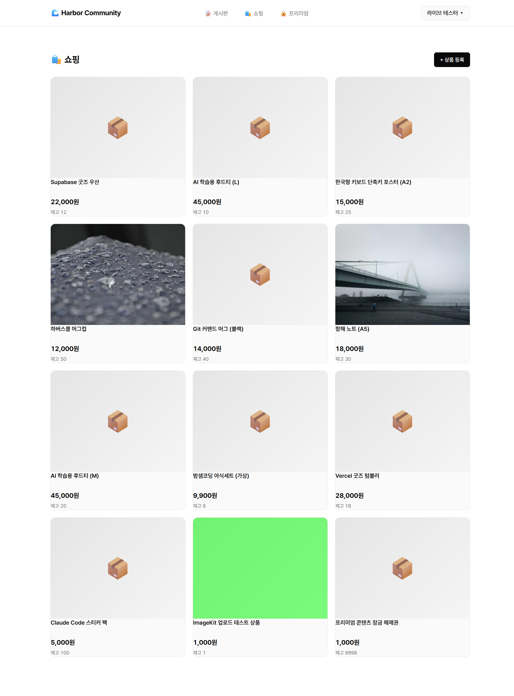
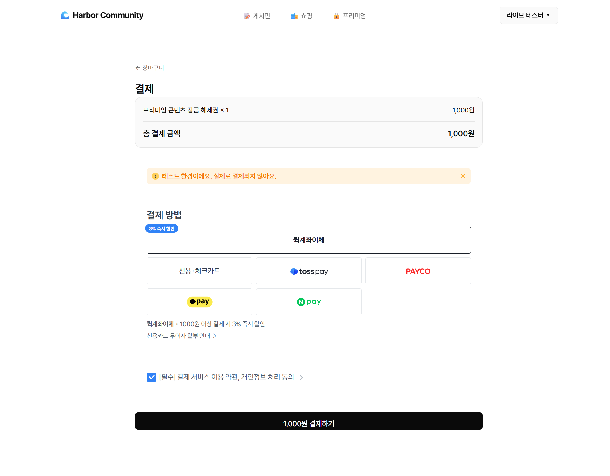

# Quest #1 — 쇼핑몰 미완성 보완 (이미지 업로드 + 결제)

5주차 Q6 쇼핑(`harbor-community`)에 빠져 있던 **이미지 업로드**와 **TossPayments 결제**를 채운다.

> ✅ **라이브 데모 검증 완료** (5/8): https://harbor-community.vercel.app/
> 프로덕션 env 3개 박힘 (`IMAGEKIT_PRIVATE_KEY` / `TOSS_CLIENT_KEY` / `TOSS_SECRET_KEY`).
> 라이브에서 새 사용자 등록 → /premium 결제 → 잠금 해제까지 풀 E2E 동작 확인 (주문 #5).

## 통합 처리 사유

- quest #1 결제와 quest #4 결제는 모두 TossPayments
- 같은 결제 모듈을 두 번 작성하면 학습 효율 ↓
- 결제 모듈 한 번 통합 작성 후 두 quest에서 재활용
- 부산물: 동네골목 v2 결제 통합 자산 자동 확보

## 통합 코드 위치

- **코드**: `D:\Dropbox\workspace\harbor-community\`
- **GitHub**: https://github.com/mmake7/harbor-community
- **라이브**: https://harbor-community.vercel.app/

5주차 Q5(게시판)+Q6(쇼핑)+Q7(Context)+Q8(AI 대시보드) 통합 SPA의 *Q6 쇼핑 영역*에 추가 작업한다.

## 사용 라이브러리

- **이미지 업로드**: ImageKit (`@imagekit/nodejs`) — 동네골목 v1.5에서 검토 중인 자산과 일치, 무료 20GB
- **결제**: TossPayments (다음 세션)

> 어제(5/7) 처음엔 Vercel Blob으로 셋업했으나 5/8 세션 시작 시 ImageKit으로 교체. 이유: 동네골목 v2 결제·이미지 자산 통합 라인이 ImageKit 쪽으로 이미 굳어져 있어 자산 재활용 효율이 더 큼.

## 충족 증적 (작업 진행하며 채움)

- [x] **이미지 업로드 동작 (실 검증 완료)** — 커밋 `mmake7/harbor-community@88cf86c` (ImageKit 최종, `2d97ecc` Vercel Blob 초안에서 교체)
  - 파일: `api/upload.js`, `api/shop.js` (`?view=product_create`), `public/index.html` (`ShopNewProduct`), `sql/005_seed_product_images.sql`
  - 실 업로드 검증 (5/8 세션):
    - `POST /api/upload` 테스트 PNG → ImageKit CDN URL 반환
    - 업로드 URL 예시: `https://ik.imagekit.io/mmake7/products/u6-1778203102595_IerUK2Bqa.png` (HTTP 200, image/png)
    - `POST /api/shop?view=product_create`로 해당 URL 박은 상품(id=11) 생성 → `/shop` 그리드에 카드 정상 렌더 (스크린샷 `shop-with-imagekit-upload.png`)
- [x] **TossPayments 결제 동작 (실 결제 검증 완료)** — 커밋 `mmake7/harbor-community@e483973`
  - 파일:
    - `sql/006_add_payment_columns.sql` — `shop_orders`에 `toss_order_id` / `payment_key` / `payment_method` / `paid_at` + unique index
    - `api/payment.js` — `?view=config` (client key 내림) + `?view=confirm` (Toss `/v1/payments/confirm` 호출 + DB 동기화 + 멱등)
    - `api/shop.js` `?view=order_create` — `toss_order_id` 자동 생성·응답
    - `public/index.html` — `ShopCheckout` (Toss 위젯 V2) + `ShopPaymentSuccess` (콜백 → confirm) + `ShopPaymentFail` + parseHash pathname 분기 + ShopOrder 결제 메타 표시
    - `dev-server.js` — SPA fallback (`/shop/payment/success` 같은 외부 진입 대응)
  - **풀 E2E 검증**: `/premium` "결제하고 보기" → Toss 위젯 → 퀵계좌이체 데모(테스트비번 000000) → Toss → `/shop/payment/success` → confirm API → DB `status=paid` → `/premium` 잠금 해제까지 한 흐름 동작

## 검증 스크린샷

### 1. 시드 이미지 2건이 상품 카드에 정상 표시

### 2. 로그인 사용자에게 ‘+ 상품 등록’ 폼 렌더 (이미지 파일 입력 포함)

### 3. ImageKit으로 실 업로드한 이미지가 카드에 정상 표시 (5/8 검증)

> 마지막 카드(id=11, "ImageKit 업로드 테스트 상품")가 `https://ik.imagekit.io/mmake7/products/...` URL로 렌더 — 업로드 → DB 저장 → 카드 표시 풀 파이프라인 완성.

### 4. TossPayments 결제 위젯 V2 정상 마운트 (5/8 검증)

> 결제수단 6종(퀵계좌이체/카드/토스페이/페이코/카카오페이/네이버페이) + 약관 동의 + "1,000원 결제하기" 버튼. 테스트 환경 안내 배너 자동 표시.

### 5. 결제 완료 후 주문 상세 화면 (5/8 검증)

> "결제 완료" 라벨 + "✅ 계좌이체 결제" 바 + `paid_at` 시각 + 주문 상품 스냅샷.

### 6. 🌐 라이브 (`harbor-community.vercel.app`) — 풀 E2E 검증 (5/8)

| 라이브 /shop (이미지 정상) | 라이브 결제 위젯 | 라이브 결제 완료 주문 |
|---|---|---|
|  |  |  |

> 새 사용자(`live-test@harbor.dev`, id=7)로 처음부터 끝까지: 회원가입 → /premium → 결제하고 보기 → Toss 위젯 → 퀵계좌이체 데모 → 결제 완료 → 주문 #5 paid 상태 확인. 프로덕션 env 3개(IMAGEKIT_PRIVATE_KEY / TOSS_CLIENT_KEY / TOSS_SECRET_KEY)가 모두 정상 동작.

## 진행 상태

- [x] 통합 구조 셋업
- [x] 이미지 업로드 (코드 + 실 검증 완료, ImageKit)
- [x] **TossPayments 통합** (코드 + 실 결제 검증 완료, 위젯 V2 + confirm + DB 동기화)
- [x] **유료잠금 페이지** (quest #4 영역, 같은 세션에 마감)

## 다음 세션 진입 안내

### 5/8 세션 완료
- ImageKit Private Key 발급 + 로컬·라이브 실 업로드 검증
- TossPayments 테스트 키(docs) `.env.local` + Vercel 프로덕션 env 박음
- 로컬 + **라이브** 풀 결제 흐름 검증 (주문 #4 로컬, 주문 #5 라이브)
- ⚠ 진단 중 발견·수정: `echo "value" | vercel env add`가 trailing `\n` 박아 ImageKit 403 + Toss 키 오염 → `printf "%s"`로 재등록 + 재배포로 해결
- **quest #1 본진 영역 마감**

### 의도적으로 미룬 것
- 결제 취소·환불 (`/v1/payments/{paymentKey}/cancel`)
- 결제 webhook 수신 (Toss → 우리 비동기)
- 카트 흐름 E2E 별도 캡처 (order_one 흐름으로 같은 파이프라인 검증됨)

## 참고 — 5주차 quest 맥락

5주차 Q6 쇼핑은 라이브 배포 + 카트·주문 트랜잭션까지 완료됐으나 다음이 빠져 있었음:
- 상품 이미지 (`shop_products.image_url` 컬럼만 있고 시드 모두 NULL)
- 실제 결제 (`status`는 `pending`/`paid` enum만 존재, PG 호출 없음)

이 두 빈 슬롯을 6주차 quest #1에서 채운다. quest #4(유료잠금 미니 앱)에서 같은 결제 모듈을 재활용한다.
