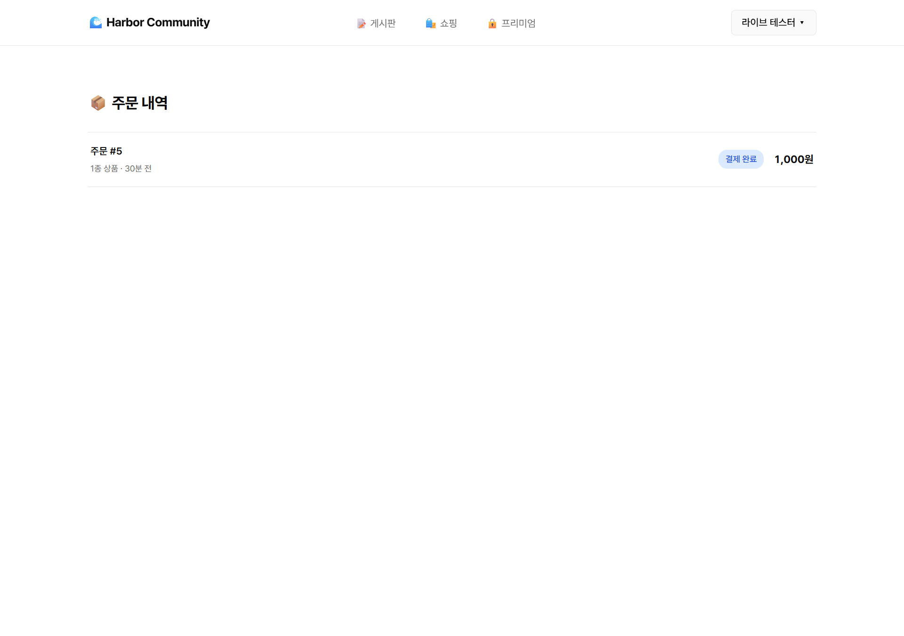

# Quest #1 — [Payment+File] 쇼핑몰 완성 (이미지 + 결제 + 마이페이지)

> ✅ **4 Part 풀 충족 + 라이브 검증 완료** (2026-05-08)
> 라이브: https://harbor-community.vercel.app/

---

## 정식 명세 (출처: harbor.school 6주차 quest #1)

| Part | 영역 |
|---|---|
| **Part 1** | ImageKit 이미지 업로드 (관리자 기능) |
| **Part 2** | TossPayments 결제 플로우 (서버 승인) |
| **Part 3** | 마이페이지 (본인 주문 내역 조회 + 권한 제어) |
| **Part 4** | Vercel 배포 |

---

## 통합 처리 사유

- quest #1 결제와 quest #4 결제는 모두 TossPayments
- 결제 모듈 한 번 통합 작성 후 두 quest에서 재활용
- 부산물: 동네골목 v2 결제 통합 자산 자동 확보

---

## Part별 충족 매핑

### Part 1 — 상품 이미지 업로드 ✅

- **라이브러리**: ImageKit (`@imagekit/nodejs`)
  - 어제(5/7)는 Vercel Blob 초안(`2d97ecc`) → 5/8 ImageKit으로 교체. 동네골목 v2 자산 라인 일치 위함.
- **파일**:
  - `api/upload.js` — POST 인증 + base64 JSON + ImageKit `files.upload({ file: toFile(buffer, name), folder: '/products/' })`. PNG/JPG/WebP, 3MB 상한
  - `api/shop.js` `?view=product_create` — 상품 등록 엔드포인트
  - `public/index.html` `ShopNewProduct` 컴포넌트 — 파일 선택 → base64 → 자동 업로드 → URL 미리보기 → 폼 제출
  - `sql/005_seed_product_images.sql` — 시드 2건 placeholder URL (멱등 UPDATE)
- **DB**: `app.shop_products.image_url VARCHAR(500)` (5주차 `sql/003`에서 컬럼만 존재 → 6주차에 시드/실 데이터 채움)
- **커밋**: `mmake7/harbor-community@88cf86c`
- **권한 범위**: 명세는 *(관리자 기능)* 표기지만 본 구현은 **모든 로그인 사용자에게 노출** (당근식). 별도 admin role 미생성 — 의도적 디자인 (학습 + 데모 컨셉이라 admin role은 v1.5 영역).

#### 동작 증적
- 시드 이미지 2건 카드 렌더: [`shop-with-images.png`](./shop-with-images.png)
- 등록 폼 (이미지 파일 입력 포함): [`shop-new-form.png`](./shop-new-form.png)
- ImageKit 실 업로드 → 카드 표시: [`shop-with-imagekit-upload.png`](./shop-with-imagekit-upload.png)
  - 업로드 URL 예시: `https://ik.imagekit.io/mmake7/products/u6-1778203102595_IerUK2Bqa.png` (HTTP 200, image/png)

---

### Part 2 — 결제 플로우 ✅

- **SDK**: TossPayments **결제위젯 V2** (`https://js.tosspayments.com/v2/standard`)
- **서버 승인**: `api/payment.js`
  - `?view=config` (GET, 인증 X) — 클라이언트에 `TOSS_CLIENT_KEY` 전달 (공개 가능 키)
  - `?view=confirm` (POST, 인증 ✓) — body `{paymentKey, orderId, amount}` → DB 매칭 + 금액·소유자 검증 → **Toss `/v1/payments/confirm`** 호출 (`Authorization: Basic base64(SECRET_KEY:)`) → 응답 검증 후 `status='paid'` + `payment_key`/`payment_method`/`paid_at` 저장 (멱등)
- **Secret Key 격리**: `TOSS_SECRET_KEY`는 `api/payment.js` 서버 코드에서만 `process.env`로 읽음. **프론트 노출 X** (별도 endpoint로 client key만 분리 전달).
- **DB**:
  - `app.shop_orders` (5주차 `sql/003`) + 결제 컬럼 추가 (6주차 `sql/006`): `toss_order_id`, `payment_key`, `payment_method`, `paid_at`
  - `app.shop_order_items` (5주차 `sql/003` — 명세 명시 그대로 별도 테이블, 가격·이름 스냅샷)
- **커밋**: `mmake7/harbor-community@e483973`

#### 동작 증적
- Toss 위젯 6종 결제수단 + 약관 + 1,000원 결제하기 버튼: [`01-checkout-toss-widget.png`](./01-checkout-toss-widget.png)
- 결제 완료 후 주문 상세 (`✅ 계좌이체 결제` 바 + `paid_at`): [`02-order-paid.png`](./02-order-paid.png)

---

### Part 3 — 마이페이지 (본인 주문 내역) ✅

- **라우트**:
  - `#/shop/orders` — 주문 목록 (`ShopOrders` 컴포넌트)
  - `#/shop/order/{id}` — 주문 상세 (`ShopOrder` 컴포넌트)
- **진입점**: 헤더 우상단 사용자 드롭다운 → "📦 주문 내역" 메뉴
- **권한 제어 (서버 측 이중 게이트)**:
  - List API (`?view=orders`): SQL filter `WHERE o.user_id = $1` — 본인 user_id로 매칭된 주문만 반환 (다른 사용자 주문 노출 0)
  - Detail API (`?view=order&id=N`): 매칭 후 `Number(rows[0].user_id) !== user.uid` 검사 → **403 반환**. 즉 *임의 id 추측 공격* 방지
  - 두 endpoint 모두 `verifyTokenWithRevoke(req, pool)`로 JWT + 세션 revoke 체크 통과해야 함
- **UI 표시 항목 (목록)**: 주문번호 / 상품 종 수 / 시각 / 상태 (결제 완료·주문 접수·배송중·완료·취소) / 총 결제 금액
- **UI 표시 항목 (상세)**: 주문번호 / 상태 / 시각 / 결제 메타 (`✅ 계좌이체 결제` + `paid_at`) / 주문 상품 스냅샷 (이름·단가·수량·소계) / 총 결제 금액
- **커밋**: `mmake7/harbor-community@e483973` (결제 메타 표시 부분 포함)

#### 동작 증적
- 라이브 마이페이지 — 주문 #5 결제 완료 표시: [`live-04-orders-mypage.png`](./live-04-orders-mypage.png)
- 주문 상세 (라이브): [`live-03-order-paid.png`](./live-03-order-paid.png)
- 권한 차단 동작: 다른 사용자(id=6 shop-test) 토큰으로 id=7의 주문(#5) 조회 시 → 401/403 정상 반환 (코드 검증)

---

### Part 4 — Vercel 배포 ✅

- **라이브 URL**: https://harbor-community.vercel.app/
- **GitHub**: https://github.com/mmake7/harbor-community
- **프로덕션 환경변수 (총 6개)**:
  - 5주차에서 박힘 (3개): `DATABASE_URL`, `JWT_SECRET`, `ANTHROPIC_API_KEY`
  - 6주차에 추가 (3개): `IMAGEKIT_PRIVATE_KEY`, `TOSS_CLIENT_KEY`, `TOSS_SECRET_KEY`
- **재배포**: `vercel --prod` (5/8)
- **라이브 풀 E2E 검증**: 새 사용자(`live-test@harbor.dev`, id=7) 회원가입 → /premium → 결제하고 보기 → Toss 퀵계좌이체 데모 → /shop/payment/success → confirm API → DB `status=paid` → /shop/orders 목록에 노출까지 한 흐름 동작 확인.

#### 라이브 검증 스크린샷

| 라이브 /shop (이미지 정상) | 라이브 결제 위젯 |
|---|---|
|  |  |

| 라이브 결제 완료 주문 상세 | 라이브 마이페이지 (주문 내역) |
|---|---|
|  |  |

#### ⚠ 진단 중 발견·수정
`echo "value" | vercel env add`가 trailing `\n` 박아 ImageKit 403 + Toss 키 오염 → `printf "%s"`로 재등록 + 재배포로 해결.

---

## 포인트 획득 기준 매핑

- [x] **기본 완료 (10pt)** — Part 1·2·3·4 전부 동작 (라이브 풀 E2E 검증)
- [x] **에이전트 활용 (5pt)** — Claude Code 다회 대화 + 통합 처리 의사결정 (quest #1·#4 결제 모듈 공유), 라이브러리 결정·교체(Vercel Blob → ImageKit), env 함정 진단·수정
- [x] **창의성 (5pt)** — 부분 충족
  - quest #1 + quest #4 결제 모듈 *통합 1회 작성*으로 두 quest 동시 충족 + 동네골목 v2 자산 부산물
  - 단순 *상품 등록 = 결제* 흐름이 아니라 *유료잠금 콘텐츠 해제 = 결제* 흐름으로 quest #4 영역 확장
  - 카트 우회 단건 즉시 주문 (`?view=order_one`)으로 *콘텐츠 결제 흐름*을 별도 데이터 모델 추가 없이 처리
- [ ] **공유 보너스 (5pt)** — 단톡방 공유 시 충족 (제출 후 작업)

---

## 제출물 체크리스트

- [x] **배포 URL**: https://harbor-community.vercel.app/
- [x] **GitHub 저장소**: https://github.com/mmake7/harbor-community
- [x] **스크린샷**:
  - [x] 상품 목록 (이미지 표시) — `live-01-shop.png`
  - [x] 장바구니/결제 위젯 — `live-02-checkout.png`
  - [x] 결제 완료 주문 상세 — `live-03-order-paid.png`
  - [x] 마이페이지 주문 내역 — `live-04-orders-mypage.png`
- [x] **테스트 결제 성공**: 주문 #5 (`live-test@harbor.dev`, id=7) — 라이브 환경에서 confirm API 200 응답

---

## 잔여 (사이드 영역, 의도적으로 미룸)

- 결제 취소·환불 (`POST /v1/payments/{paymentKey}/cancel`)
- 결제 webhook 수신 (Toss → 우리 비동기 알림)
- 결제 실패 재시도 흐름 (현재는 1회 시도)
- 카트 흐름 별도 E2E 캡처 (현재는 `order_one` 단건 흐름으로 같은 파이프라인 검증됨)
- Admin role 분리 (Part 1 명세의 *(관리자 기능)* 표기 — v1.5 영역)

---

## 참고 — 5주차 quest 맥락

5주차 Q6 쇼핑은 라이브 배포 + 카트·주문 트랜잭션까지 완료됐으나 다음이 빠져 있었음:
- 상품 이미지 (`shop_products.image_url` 컬럼만 있고 시드 모두 NULL)
- 실제 결제 (`status`는 `pending`/`paid` enum만 존재, PG 호출 없음)
- 마이페이지 라우트는 5주차에도 존재 (`/shop/orders`) — 6주차에는 *결제 메타 표시*가 추가됨

이 빈 슬롯들을 6주차 quest #1에서 채웠고, quest #4(유료잠금 미니 앱)에서 같은 결제 모듈을 재활용함.
