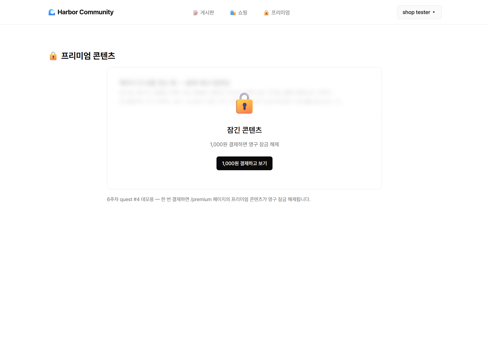
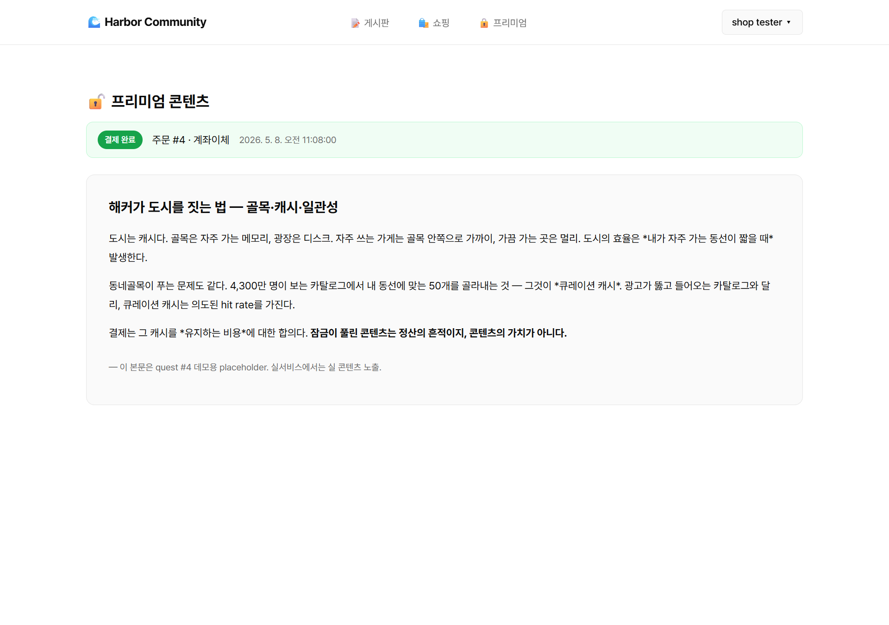
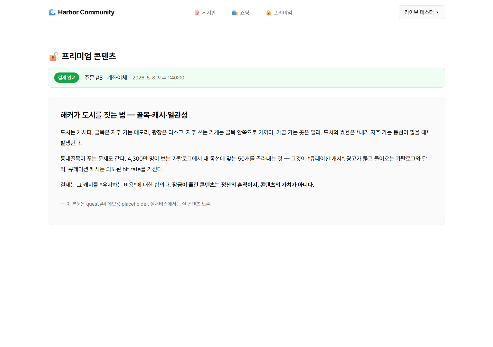

# Quest #4 — 유료잠금 미니 앱 (이미지 업로드 + 결제 + 유료잠금)

콘텐츠를 *결제 후에만* 볼 수 있는 유료잠금 미니 앱. quest #1과 결제 모듈을 공유한다.

> ✅ **라이브 데모 검증 완료** (5/8): https://harbor-community.vercel.app/#/premium
> 새 사용자가 잠금 화면 → 결제 → 잠금 해제 + 본문 노출까지 한 흐름 동작 확인.

## 통합 처리 사유

- quest #1 결제와 quest #4 결제는 모두 TossPayments
- 같은 결제 모듈을 두 번 작성하면 학습 효율 ↓
- 결제 모듈 한 번 통합 작성 후 두 quest에서 재활용
- 부산물: 동네골목 v2 결제 통합 자산 자동 확보

## 통합 코드 위치

- **코드**: `D:\Dropbox\workspace\harbor-community\`
- **GitHub**: https://github.com/mmake7/harbor-community
- **라이브**: https://harbor-community.vercel.app/

quest #1과 동일 SPA 안에 *유료잠금 라우트(예: `/locked`)*를 추가한다.

## 사용 라이브러리

- **이미지 업로드**: ImageKit (`@imagekit/nodejs`) — quest #1과 공유
- **결제**: TossPayments — quest #1과 공유 (다음 세션)

> 5/7에 Vercel Blob으로 셋업했으나 5/8에 ImageKit으로 교체. 동네골목 v2 자산 라인과 일치시키기 위함.

## 충족 증적 (작업 진행하며 채움)

- [x] **이미지 업로드 동작 (실 검증 완료)** — quest #1과 공유, 커밋 `mmake7/harbor-community@88cf86c` (ImageKit 최종)
  - 5/8 세션에서 ImageKit URL 직접 발급 + `/shop` 카드 렌더 확인
  - 검증 스크린샷 3장 (`shop-with-images.png` / `shop-new-form.png` / `shop-with-imagekit-upload.png`) → [`../quest1-shopping-completion/`](../quest1-shopping-completion/) 참조
- [x] **TossPayments 결제 동작 (실 결제 검증 완료)** — quest #1과 공유, 커밋 `mmake7/harbor-community@e483973`
  - quest #1 README의 결제 모듈 그대로 재활용
- [x] **유료잠금 페이지 동작 (실 검증 완료)** — 커밋 `mmake7/harbor-community@e483973`
  - 파일:
    - `sql/007_seed_premium_product.sql` — '프리미엄 콘텐츠 잠금 해제권' 1건 시드 (1,000원, 멱등)
    - `api/shop.js` `?view=order_one` — 카트 우회 단건 즉시 주문
    - `api/shop.js` `?view=premium_status` — 프리미엄 상품 paid 여부 + 결제 메타
    - `public/index.html` — `PremiumPage` 컴포넌트 + 헤더 "🔒 프리미엄" 메뉴 + `/premium` 라우트
  - **풀 E2E 검증**: 잠금 화면(블러+오버레이) → "결제하고 보기" → 결제 완료 → 잠금 해제 + 본문 노출 + 결제 영수증 표시

## 진행 상태

- [x] 통합 구조 셋업
- [x] 이미지 업로드 (코드 + 실 검증 완료, ImageKit / quest #1과 공유)
- [x] **TossPayments 통합** (quest #1과 공유 모듈, 실 결제 검증 완료)
- [x] **유료잠금 페이지** (PremiumPage + premium_status + order_one, 실 잠금/해제 검증)

## 다음 세션 진입 안내

### 5/8 세션 완료
- ImageKit / TossPayments 라이브 데모 검증 완료 (quest #1과 공유)
- 유료잠금 페이지(PremiumPage) — 로컬·라이브 양쪽에서 잠금/해제 흐름 검증
- **quest #4 본진 영역 마감**

### 검증 스크린샷 — 로컬 (5/7)

| 1. 잠금 상태 (블러 + 결제 유도) | 2. 결제 완료 후 잠금 해제 + 본문 노출 |
|---|---|
|  |  |

### 🌐 라이브 (`harbor-community.vercel.app`) — 풀 E2E 검증 (5/8)

| 라이브 잠금 화면 | 라이브 잠금 해제 + 본문 |
|---|---|
|  |  |

> 새 사용자(`live-test@harbor.dev`, id=7)로 처음부터 끝까지: 잠금 화면 → "1,000원 결제하고 보기" → Toss 퀵계좌이체 데모 → 결제 완료 → /premium 영구 잠금 해제 + 영수증("주문 #5 · 계좌이체 · 5/8 13:40").

> 결제 흐름 자체 스크린샷(Toss 위젯, 주문 상세)은 [`../quest1-shopping-completion/`](../quest1-shopping-completion/) 참조 — 같은 결제 모듈 공유.

### 잔여 (라이브 데모 시점)
- 프로덕션 env 추가 (quest #1 README와 동일)

### 의도적으로 미룬 것
- 잠금 해제권 *재구매* 흐름 (현재는 한 번 사면 영구)
- 콘텐츠 *카탈로그형* (여러 잠금 콘텐츠) — 현재는 단일 콘텐츠 1건만

## 컨셉

- 콘텐츠 1개 (이미지 + 본문)을 *유료잠금* 처리
- 비결제 사용자: 잠금 화면 + 결제 버튼만 표시
- 결제 완료 사용자: 콘텐츠 풀 노출
- 결제 상태 검증은 서버 측에서 (`shop_orders.status = 'paid'` 또는 별도 `unlocks` 테이블)

## 다음 세션에서 결정

- 콘텐츠 단위: 단일 콘텐츠 1건 vs 여러 건 카탈로그
- 결제 단위: 1회 구매 vs 구독
- 환불·만료 정책 (간단 데모면 생략 가능)
