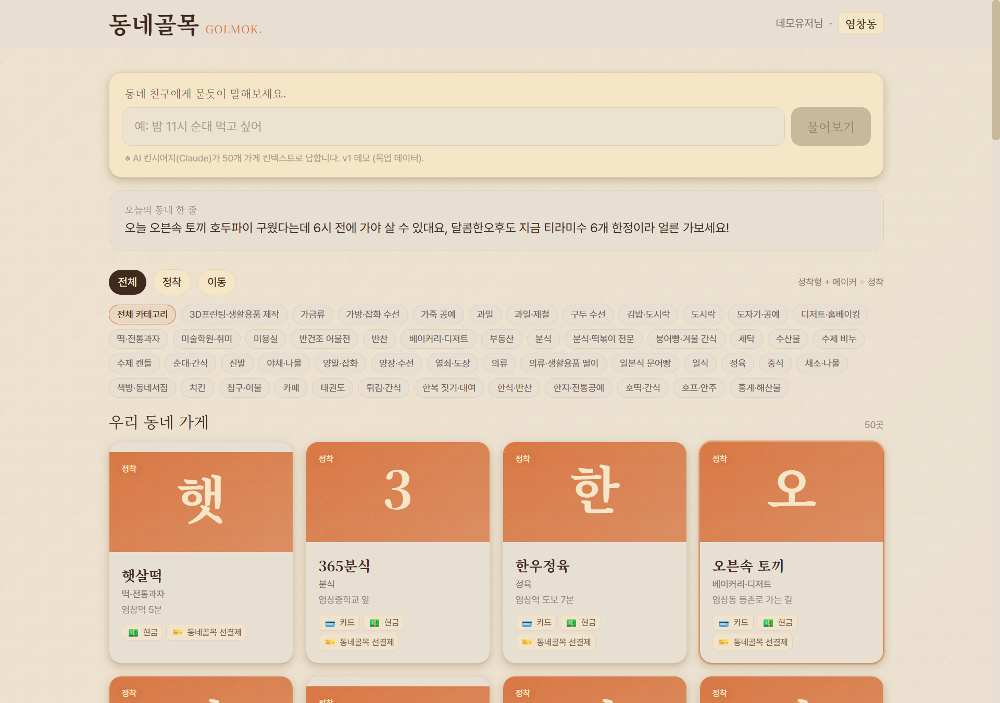
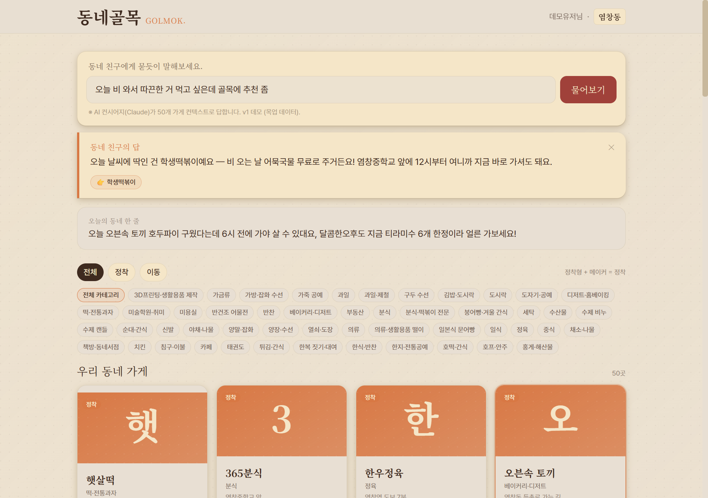

# Quest #5 — 당근 클론 → 동네골목 pivot

원래 6주차 quest #5 (형 기억): **"당근마켓 클론"**. 6주차 진행 중 *학습용 클론*에서 *본인 사업 자산*으로 격상되어 **동네골목** (별도 repo)으로 진화. 본 README는 그 pivot 결정과 현재 진행 상태를 등록한다.

> ✅ **라이브 데모 검증 완료** (5/8): https://dongne-golmok.vercel.app/
> 50개 가게 정적 데이터 + Claude Sonnet 4.6 컨시어지 + ephemeral 캐싱(10,737 tokens) 풀 동작.

---

## pivot 사유

| | 원래 | 진화 후 |
|---|---|---|
| 정체성 | 학습용 당근마켓 클론 | 본인 사업의 v1 파일럿 |
| 컨셉 | 단순 중고거래 클론 | AI 컨시어지가 *우리 동네 작은 가게*와 *주민의 상황*을 매칭하는 **동네 알림 서비스** |
| 출처 | harbor.school 6주차 미션 | 형의 첫 직감 + 시장 공백 발견 |
| 마감 형식 | 학습 quest 제출 | 투자자·협력자에게 보여줄 데모 |

> 결정 인용 (`harbor-school/week6/MD/MISSION.md`):
>
> *"수능시험도 아니고 결국 내 발전을 위한 거"*
> *"quest #5 마감보다 본 프로젝트 우선"*

학습 quest 갈음용 졸속 작성을 회피하고, 본 프로젝트 자체를 quest 충족 증적으로 등록.

---

## 변경 이력 (6주차 진행 중)

| 시점 | 사건 | 메모 |
|---|---|---|
| Day 초반 | 당근마켓 클론으로 시작 | harbor.school 6주차 미션 그대로 따라감 |
| Day 중반 | 가내수공업·트럭음식 *입고 알림*으로 변형 | 형의 첫 직감 — "단순 클론 X" |
| Day 중반 | "**숨어있는 우리동네가게**" 키워드 도입 | "비공식 상권" 톤이 너무 행정적이라 교체 |
| Day 후반 | **AI 컨시어지** 컨셉 진화 | quest #2 Radar v2의 "4가지 발견 양식" 인사이트 직접 반영 |
| Day 후반 | quest 마감보다 본 프로젝트 우선 결정 | 학습 → 사업 자산 격상 |
| Day 후반 | **동네골목** 단독 repo 분리 | `mmake7/dongne-golmok` |

---

## 현재 진행 상태 (2026-05-08 기준)

| Phase | 내용 | 상태 |
|---|---|---|
| Phase 1 | UI 골격 (단일 `index.html`, React CDN + Tailwind CDN + Babel standalone) | ✅ |
| Phase 2 | 백엔드 서버리스 함수 (`api/*.js` Vercel + pg) — 목업 모드 | ✅ |
| Phase 3 | AI 컨시어지 (Claude Sonnet 4.6 + 50개 가게 컨텍스트 + ephemeral 캐싱) | ✅ |
| **Phase 4** | **Vercel 프로덕션 배포 + 라이브 동작 검증** | **✅ (5/8)** |
| v1.5 | 디자인 정교화 / DEV.md 보강 / AUDIENCES.md / PostgreSQL 본격 / fal 이미지 / PWA | ⏳ 사이드 영역 |

마지막 dongne-golmok 커밋: `ca38e2f fix: AI 안내 문구 stale 라벨 갱신`

### Phase 4 라이브 검증 (5/8)

| 라이브 홈 (50개 가게 + AI 입력) | AI 컨시어지 응답 |
|---|---|
|  |  |

검증 항목:
- ✅ `https://dongne-golmok.vercel.app/` 도달 (Vercel alias)
- ✅ `/api/shops` — 50개 가게 정적 데이터 응답
- ✅ `/api/ai` — Claude Sonnet 4.6 호출 + 톤 있는 응답 + 가게 ID 참조
- ✅ ephemeral 캐싱 동작: 시스템 프롬프트(50개 가게 컨텍스트) 10,737 tokens가 `cache_creation_input_tokens`로 잡힘 → 후속 호출은 cache hit
- ✅ KST 시간 정확 ("2026년 5월 8일 금요일 13:57")
- ✅ UI 응답: 가게 카드 클릭 가능한 "👉 가게이름" 버튼 렌더

라이브 검증 중 발견한 stale 라벨("Phase 1 — AI 컨시어지는 Phase 3에서 연결됩니다") 즉시 패치 → `ca38e2f` 재배포로 해결.

---

## 산출물 위치

**동네골목 repo**: https://github.com/mmake7/dongne-golmok

### 기획·데이터 문서 7종 (모두 `main` 브랜치, `docs/`)

| 파일 | 줄수 | GitHub |
|---|---|---|
| `README.md` | 77 | https://github.com/mmake7/dongne-golmok/blob/main/docs/README.md |
| `MISSION.md` | 254 | https://github.com/mmake7/dongne-golmok/blob/main/docs/MISSION.md |
| `CONCEPT.md` | 246 | https://github.com/mmake7/dongne-golmok/blob/main/docs/CONCEPT.md |
| `ROADMAP.md` | 322 | https://github.com/mmake7/dongne-golmok/blob/main/docs/ROADMAP.md |
| `DEV.md` | 438 | https://github.com/mmake7/dongne-golmok/blob/main/docs/DEV.md |
| `shops_mock.md` | 861 | 염창동 50개 가게 목업 데이터 |
| `scenarios_mock.md` | 268 | 8개 컨시어지 데모 시나리오 |
| `PAYMENT.md` | 142 | 선결제 모델 (quest #1·#4 결제 모듈과 연결) |

### 코드 (Phase 1~3)
- `index.html` — 단일 파일 SPA
- `api/*.js` — 서버리스 함수
- `data/` — 50개 가게 정적 데이터

---

## quest #2 자산 활용

6주차 quest #2 (Radar v2 경쟁 리서치)의 결과물 **"4가지 발견 양식"**(재미·검색·가까움·맥락)이 동네골목의 핵심 차별점 정의에 직접 반영됨:

| 활용 영역 | 반영 내용 |
|---|---|
| 차별점 정의 | "4가지 발견 양식" 표 그대로 동네골목 *맥락 발견* 슬롯 명시 |
| 랜딩 카피 후보 3개 | "광고 없는 동네 비서", "검색 말고 대화로", "골목 사정 아는 친구" |
| AI 시스템 프롬프트 톤 | "당신은 검색 엔진이 아니라 골목 비서다" |
| MISSION.md / CONCEPT.md | 당근/네이버/인스타와의 비교 표가 본 문서에 흡수 |

> 참조: [`../quest2-research-agent/insights/2026-05-07-dongne-golmok-differentiation.md`](../quest2-research-agent/insights/2026-05-07-dongne-golmok-differentiation.md)

quest #2와 quest #5는 *서로 자산을 주고받는* 관계 — quest #2의 인사이트가 quest #5의 컨셉을 정의하고, quest #5의 본 프로젝트가 quest #2 인사이트를 *실 화면*으로 검증함.

---

## 다음 세션 진입점

Phase 4 마감 → 다음은 **데모 반응 수집** 인터벌 또는 **v1.5** 진입.

| 옵션 | 작업 | 시간 |
|---|---|---|
| **인터벌** | 협력자·투자자에게 라이브 URL 공유 + 반응 수집. 별도 작업 없음 (대기 모드) | — |
| **v1.5** | 디자인 정교화 / AUDIENCES.md (반응 수집 후) / PostgreSQL 본격 / fal 이미지 / PWA | 다세션 |
| 후속 패치 (선택) | 8개 시나리오 풀 톤 검증 (`docs/scenarios_mock.md`) — 톤 일관성·가게 매칭 정확도 | 1~2시간 |

추천: **인터벌 우선.** v1.5는 데모 반응 보고 우선순위 결정.

### Phase 4 셋업 메모 (참고용 — 이미 끝난 작업)

```powershell
cd D:\Dropbox\workspace\dongne-golmok
vercel link --yes --scope mmake7-3440s-projects   # 새 프로젝트 자동 생성
tr -d '\n' < /tmp/key.txt | vercel env add ANTHROPIC_API_KEY production   # 줄바꿈 함정 회피
vercel --prod --yes   # alias https://dongne-golmok.vercel.app
```

---

## 메타: 학습 quest로서의 평가

- 학습 quest 충족 형식: **갈음** (별도 repo + 4 Phase + 7종 문서)
- *형식적 마감*보다 *본 프로젝트로 격상하는 의사결정 자체*가 6주차의 핵심 산출물.
- 같은 결정 패턴이 quest #3에도 적용됨 — *학습 quest 충족용 형식 문서*보다 *본 프로젝트 자산이 되는 문서*가 우선.
