# Week 7 — 디자인 시스템 + 개인 프로젝트

7주차는 **5톤 비주얼 디자인 시스템**을 만들고 → 자동화하고 → 실전 산출물에 적용하는 한 사이클.

3-tier 구조:
- **Goblin** (워밍업) — 톤 실험·실측
- **Agent** (자동화) — 고블린 패턴을 config로 추상화
- **Quest** (실전) — 디자인 시스템을 실제 산출물에 적용
- **Final** (메인) — 개인 프로젝트 v1 (대기)

---

## 진행 현황

| # | 카테고리 | 항목 | 상태 | 폴더 |
|---|---|---|---|---|
| **G1** | 🟢 Goblin | YouTube 썸네일 (1920×1080 + 1080×1920) | ✅ | [`goblin/thumbnail-generator/`](./goblin/thumbnail-generator/) |
| **G2** | 🟢 Goblin | Instagram 광고 카드 (1080×1080) | ✅ | [`goblin/instagram-card-generator/`](./goblin/instagram-card-generator/) |
| **G3** | 🟢 Goblin | 프로필 카드 (1200×630) | ✅ | [`goblin/profile-card-generator/`](./goblin/profile-card-generator/) |
| **A1** | 🟡 Agent | static-visual-maker (G1·G2·G3 통합 + config) | ✅ | [`agent/static-visual-maker/`](./agent/static-visual-maker/) |
| **Q1** | 🟠 Quest | 명함 (DAONi 박인수, Tech Minimal + 한지) | ✅ | [`quest/business-card/`](./quest/business-card/) |
| **Q2** | 🟠 Quest | TYPA 카페 메뉴판 (엔젤코어 + 다크 고딕) | ✅ | [`quest/cafe-menu-typa/`](./quest/cafe-menu-typa/) |
| **Q3** | 🟠 Quest | TYPA 라벤더 크림 소다 신메뉴 포스터 | ✅ | [`quest/cafe-poster-typa-lavender/`](./quest/cafe-poster-typa-lavender/) |
| **F1** | 🔴 Final | 오늘의집 클론 (today-room) — Next.js 14 + 자체 JWT + pg + ImageKit + TossPayments | ✅ 9/9 시나리오 검증 + gpt-image-1 5종 시드 / 🌐 [today-room.vercel.app](https://today-room.vercel.app) | [`final/today-room/`](./final/today-room/) |
| **F2** | 🔵 Final | 보너스 | ⏳ | — |

---

## 출력물 갤러리

### 🟢 Goblin (G1·G2·G3)
| G1 YouTube 썸네일 (가로) | G2 Instagram 카드 | G3 프로필 카드 (OG/블로그) |
|---|---|---|
|  |  |  |
| 1920×1080 | 1080×1080 | 1200×630 |

> TONE_1 Deep Navy & Gold만 미리보기. 5톤 풀세트는 [`goblin/README.md`](./goblin/README.md) 참조.

### 🟡 Agent (A1)
| A1 Static Visual Maker — 스모크 (TONE_1 × instagram-card) |
|---|
|  |

### 🟠 Quest (Q1·Q2·Q3)
| Q1 명함 (앞) | Q1 명함 (뒤) |
|---|---|
| 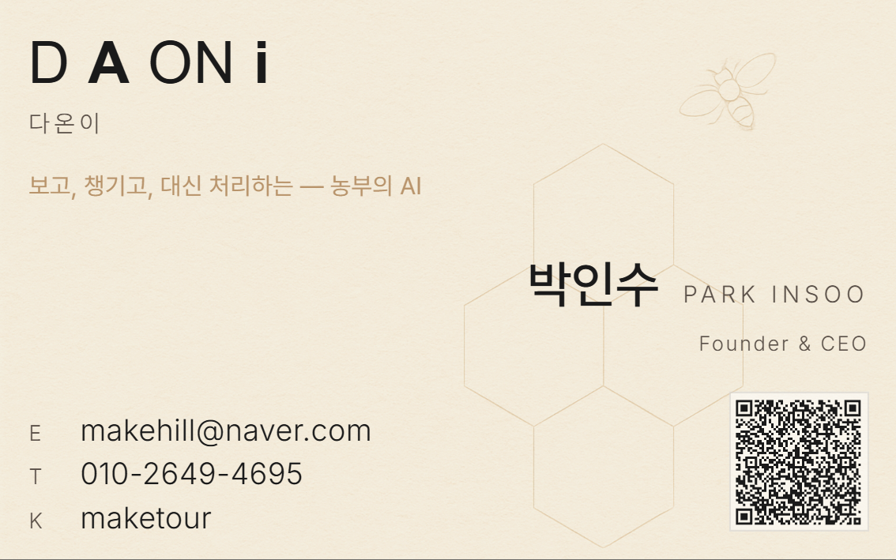 | 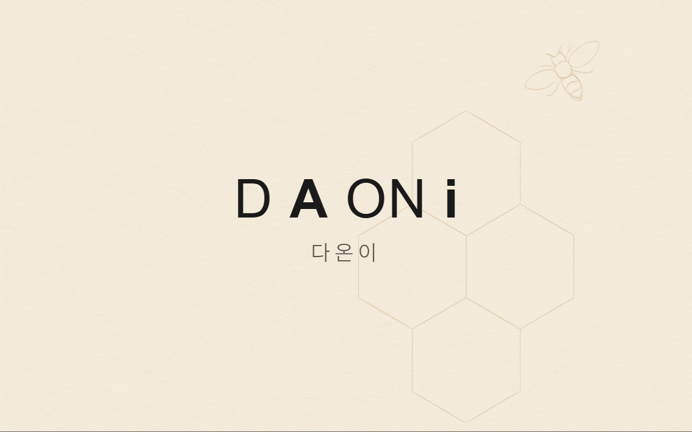 |

| Q2 TYPA 카페 메뉴판 | Q3 라벤더 크림 소다 포스터 |
|---|---|
| 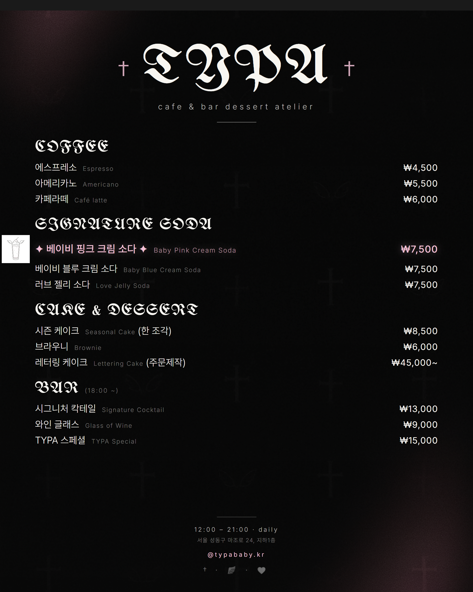 | 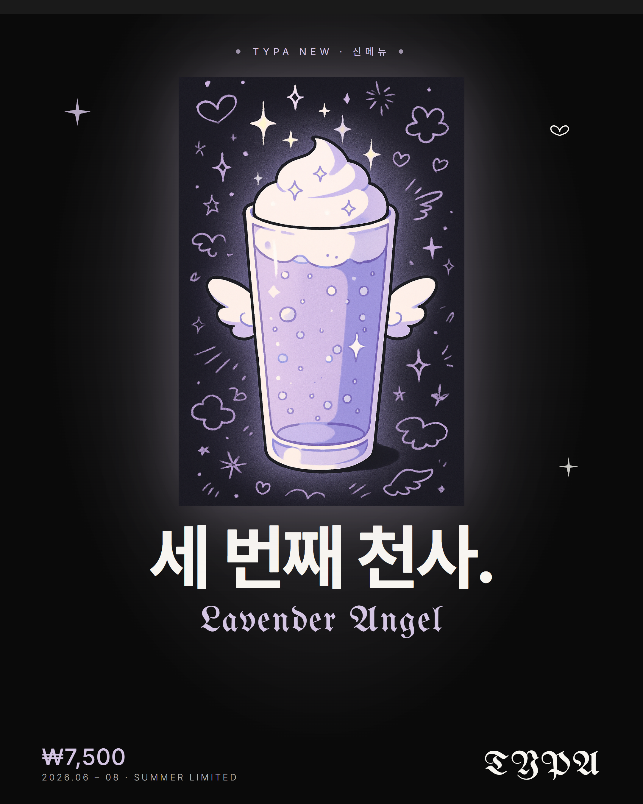 |

### 🔴 Final (F1)

today-room — 오늘의집 클론. Next.js 14 App Router + 자체 JWT + Supabase Postgres + ImageKit + TossPayments. 9/9 시나리오 라이브 검증 완료. 라이브: [today-room.vercel.app](https://today-room.vercel.app)

| F1 메인 (gpt-image-1 시드 5종) | F1 상품 상세 |
|---|---|
| 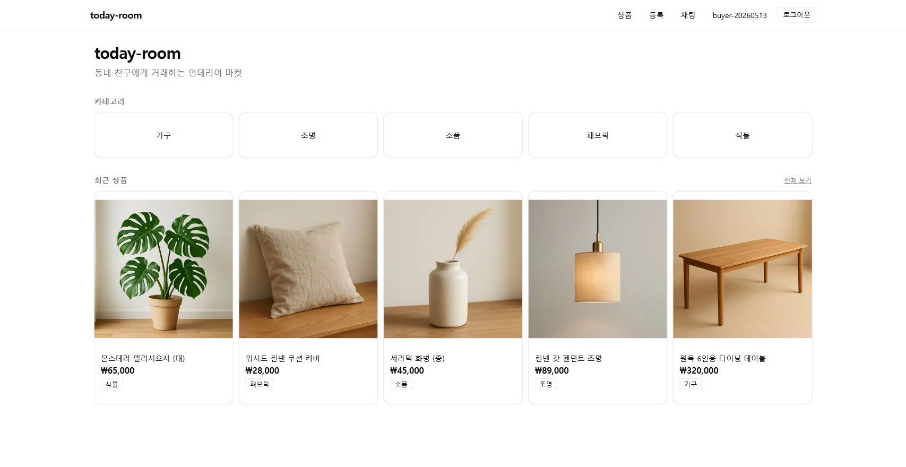 | 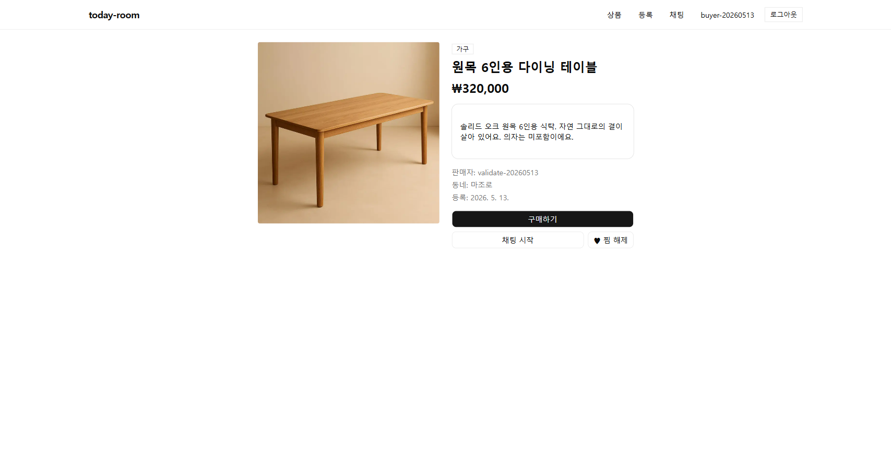 |

| F1 채팅 (3초 polling) | F1 결제 (TossPayments) | F1 마이페이지 (주문·찜) |
|---|---|---|
| 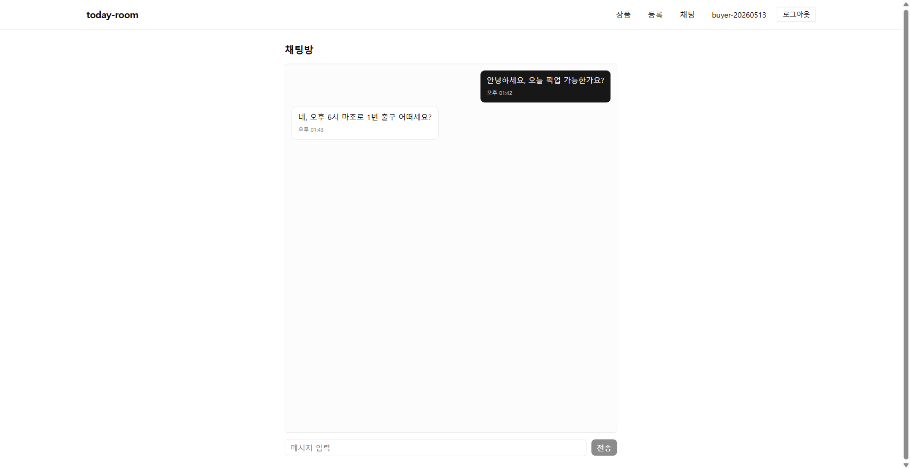 | 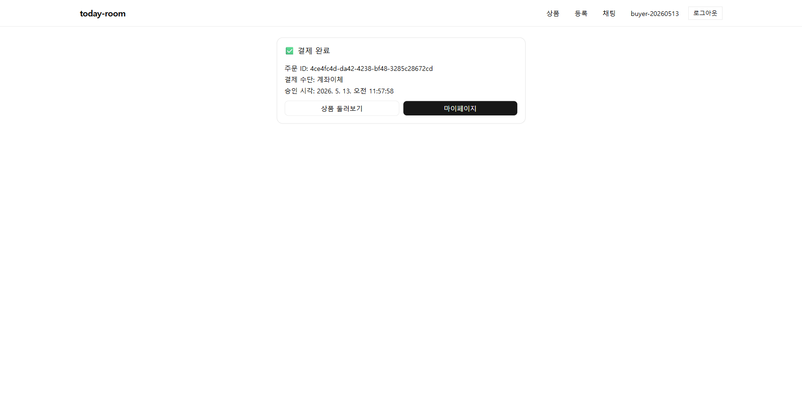 | 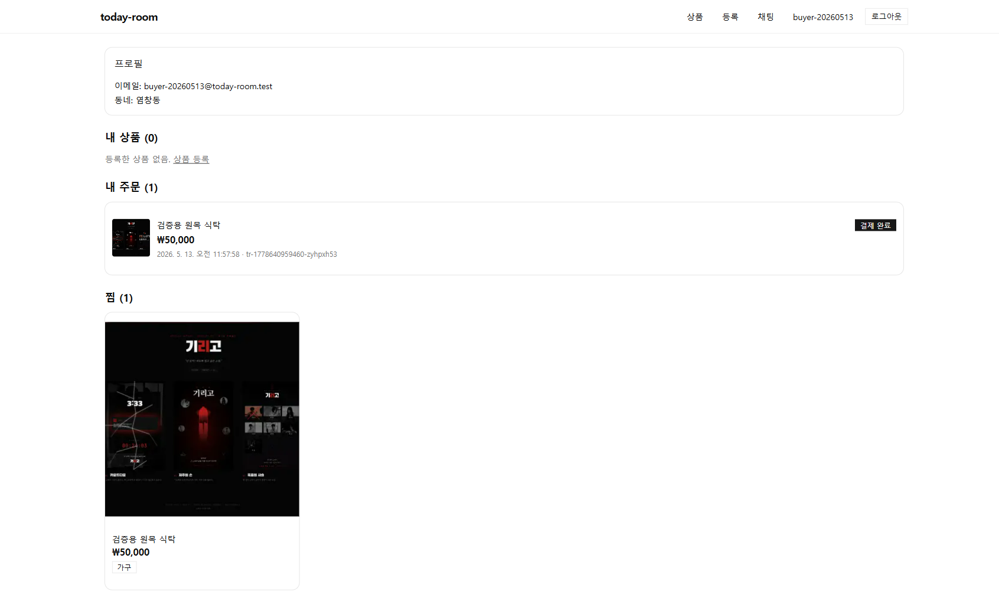 |

> 시연 흐름·검증 결과·발견·해결 이슈는 [`final/today-room/README.md`](./final/today-room/README.md) 참조.

---

## 폴더 구조

```
week7/
├── README.md                  (이 파일 — 7주차 인덱스)
├── ss/                        (에이전트 대화 캡처 — 학습 증적)
│
├── goblin/                    🟢 워밍업 고블린 3종
│   ├── README.md
│   ├── thumbnail-generator/   (G1)
│   ├── instagram-card-generator/ (G2)
│   └── profile-card-generator/(G3)
│
├── agent/                     🟡 자동화 에이전트
│   ├── README.md
│   └── static-visual-maker/   (A1)
│
├── quest/                     🟠 디자인 퀘스트 3종
│   ├── README.md
│   ├── business-card/         (Q1)
│   ├── cafe-menu-typa/        (Q2)
│   └── cafe-poster-typa-lavender/ (Q3)
│
└── final/                     🔴 Final
    └── today-room/            (F1 — 오늘의집 클론, Next.js 14 + Supabase + Toss)
        ├── README.md          (시연 흐름·검증 결과·발견 이슈)
        ├── app/  components/  lib/  types/  middleware.ts
        ├── supabase/schema.sql
        ├── scripts/           (apply-schema · check-imagekit · generate-product-images)
        └── screenshots/       (라이브 검증 5장)
```

각 카테고리 README에서 상세 확인.

---

## 에이전트 대화 캡처

각 항목 작업 전 형이 클로드AI에서 톤·컨셉·디자인 방향을 잡은 대화 기록. 5주차 `screenshots/agent/` 패턴 동일.

| 항목 | 핵심 작업 | 캡처 |
|---|---|---|
| G1 YouTube 썸네일 | 채널 톤 분석 → 5톤 1차 제안 | 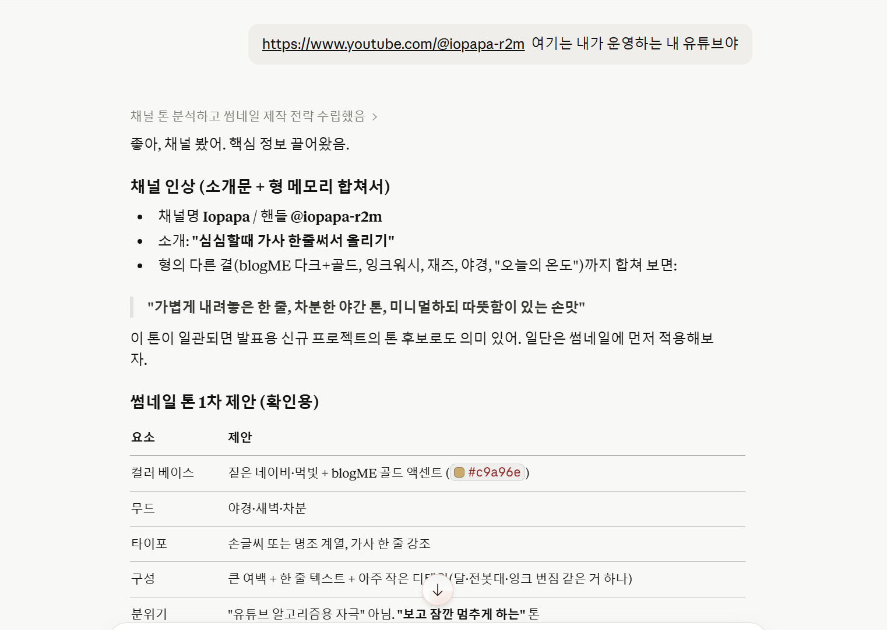 |
| Q1 명함 | DAONi 페르소나·로고 방향 | 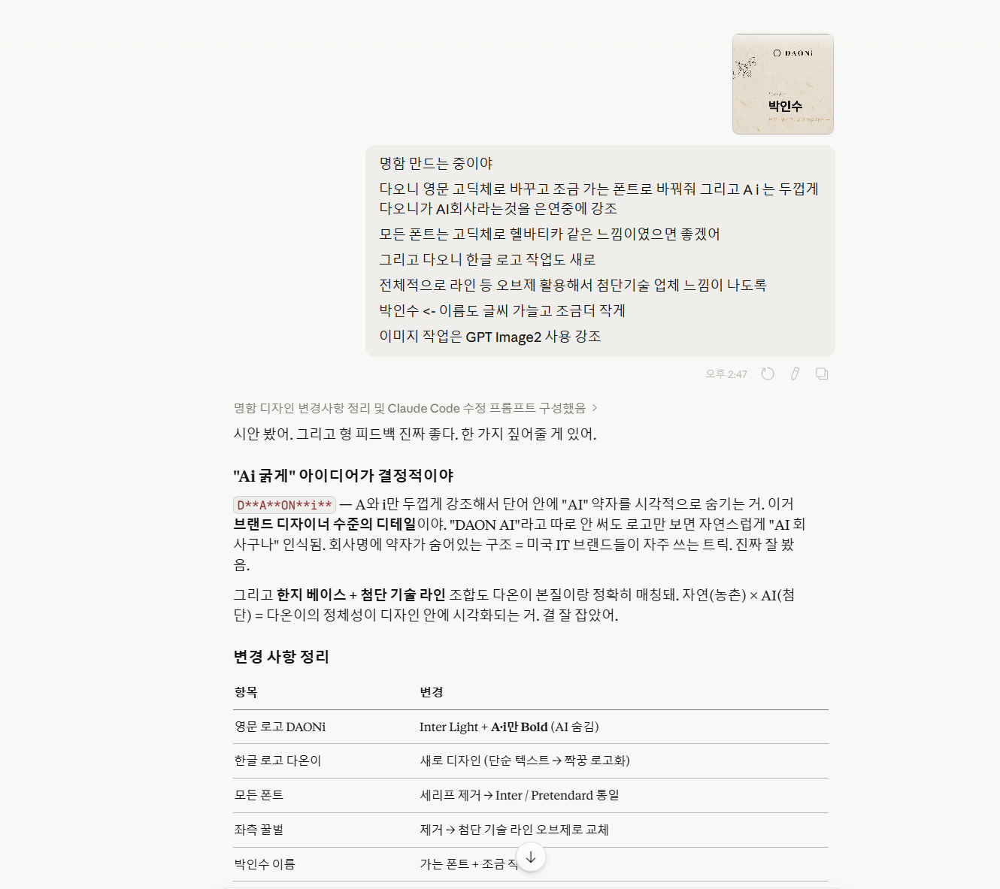 |
| Q2 카페 메뉴판 | TYPA 컨셉·메뉴 구조 | 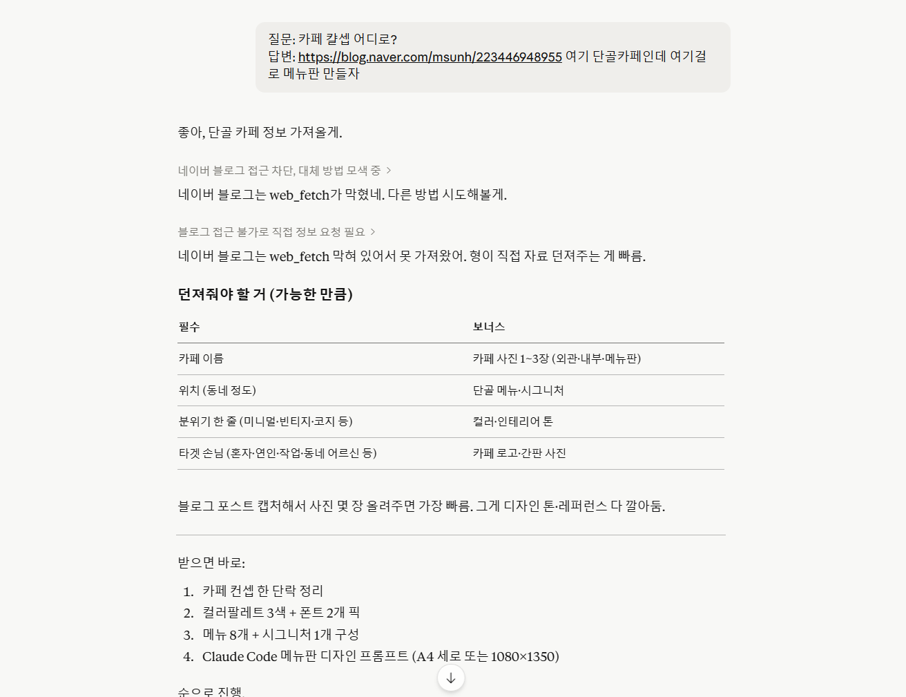 |
| Q3 라벤더 포스터 | 신메뉴 컨셉·메인 카피·비주얼 | 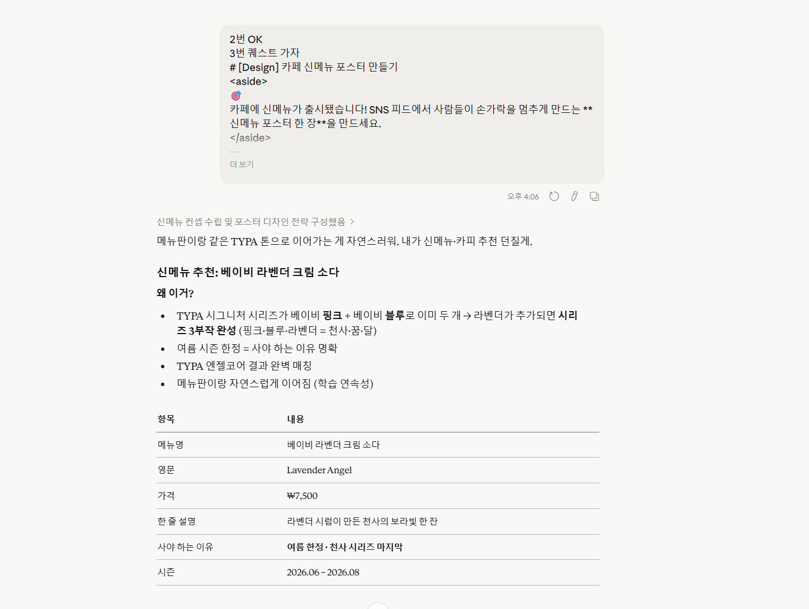 |
| Q4 today-room (F1) | 오늘의집 클론 스택·6주차 패턴 이식·DB 스키마 | 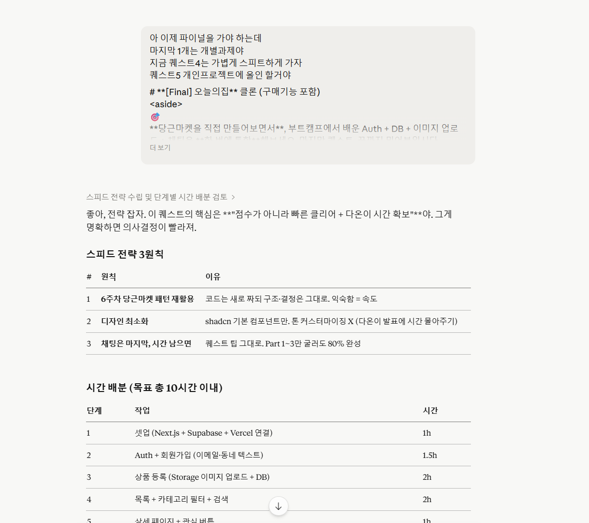 |

---

## 회고

**5톤 디자인 시스템 한 사이클** — 톤 정의(`shared/tones.js`) 하나를 G1(1920×1080)·G2(1080×1080)·G3(1200×630) 세 가지 비율에 적용해보고, A1에서 셋의 공통 패턴을 config로 압축한 다음, Q1(명함)·Q2(메뉴판)·Q3(포스터)에서 **다른 톤 시스템**(Tech Minimal + 한지 · 엔젤코어 + 다크 고딕 · 라벤더 + 마법소녀)을 실전 산출물에 적용했다.

핵심 학습: **gpt-image-1의 사이즈·텍스트 제약**(1024×1024 / 1024×1536 / 1536×1024 3종만, 한글 합성 위험)을 `sharp` crop+resize와 SVG 텍스트 합성으로 흡수. 디자인 의사결정은 모두 **형이 클로드AI에서 톤·컨셉을 먼저 잡고**(ss/ 캡처 참조) 우리가 코드로 옮기는 흐름.

전반전 비용 (Goblin + Quest 자산 생성, medium quality): **~$1.42**.

---

## 실행

각 미니앱은 로컬 실행:
```powershell
cd <카테고리>/<프로젝트>
npm install
# .env (.env.example 참조 — OPENAI_API_KEY)
node server.js
# → http://localhost:3000
```

자세한 실행법·API·결과 그리드는 각 프로젝트 README에서.

---

## 참고

- 6주차 공식 미션 PDF 없음. 7주차도 동일 — 클로드AI 프롬프트 단위 수신.
- 고블린·에이전트·퀘스트·파이널 4 개념 별개. 혼용 금지.
