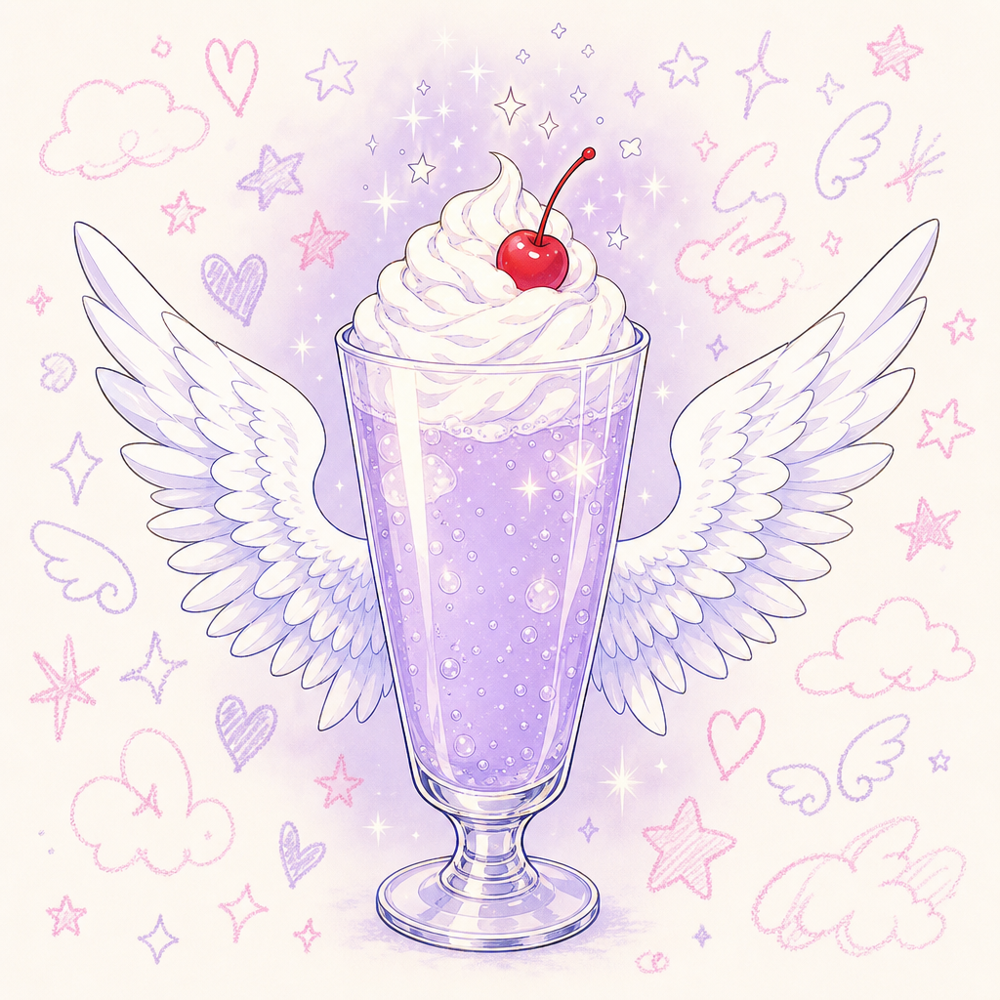
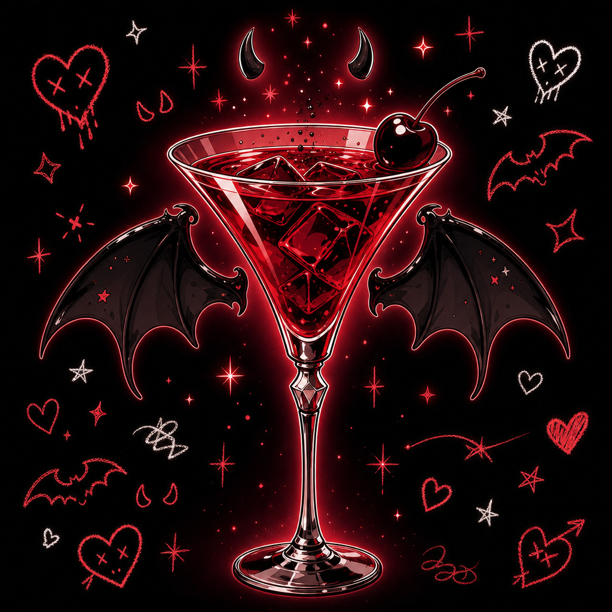

# TYPA Poster v2 — 천사 vs 악마 자매 시리즈

v1(단일 라벤더 천사 포스터)이 톤·결이 약했다는 평가 → v2는 **천사 vs 악마 두 panel 시리즈** + 측정 가능한 강화 지시. (v1 폴더는 폐기)

## 결과 미리보기

| 🪽 Lavender Angel (라이트, 인쇄용) | ⛧ Lavender Devil (다크, SNS) |
|---|---|
|  |  |
| "세 번째 천사." · 베이비 라벤더 크림 소다 + 천사 날개 | "세 번째 악마." · 크림슨 데빌 칵테일 + 박쥐 날개 (키치 데빌-걸) |

> 위는 메인 비주얼 자산. 최종 포스터(카피·서브·doodles·메타 합본)는 `index.html` 로컬 미리보기 또는 Puppeteer 렌더 후 `output/poster-{dark,light}.png` 참조.

---

## 결정 사항

- **캔버스**: 각 1080×1350 (인스타 4:5 표준)
- **두 panel 가로 나란히** — Dark (SNS 노출) + Light (인쇄 친화) 같은 페이지에서 비교 가능
- **두 신메뉴 시리즈**:
  - 🪽 **𝕷𝖆𝖛𝖊𝖓𝖉𝖊𝖗 𝕬𝖓𝖌𝖊𝖑** — 베이비 라벤더 크림 소다 / "세 번째 천사."
  - ⛧ **𝕷𝖆𝖛𝖊𝖓𝖉𝖊𝖗 𝕯𝖊𝖛𝖎𝖑** — 크림슨 칵테일 / "세 번째 악마." (키치 데빌-걸 결)
- **컬러**: Black #0A0A0A / Off-white #F8F6F1 / Baby Lavender #D4C5E3 / Crimson #C0212C (악마)
- **결**: 90s 마법소녀 anime (Sailor Moon · Cardcaptor Sakura) + 키치 빌런 결

---

## 측정 지시 (v1 실패 원인 보완)

| 항목 | 측정 |
|---|---|
| 메인 카피 ("세 번째 천사/악마.") | 170px Pretendard Black Heavy (한 줄 nowrap) |
| 서브 영문 | UnifrakturMaguntia 50px (메인 카피의 ~29%) |
| 메인 비주얼 | 594×594 (캔버스 폭의 55%) |
| 크레용 낙서 데코 | 44-64px, opacity 0.6-0.7, 8개 흩뿌림 |
| 하단 메타 | 가격 28px · 기간 13px · 브랜드 32px (UnifrakturMaguntia) |
| panel 패딩 | 80px 상 / 70px 좌우 / 70px 하 |

---

## 자산 (2장, gpt-image-2 medium 1024×1024)

| ID | 설명 |
|---|---|
| `angel-visual.png` | 라벤더 크림 소다 + 흰 천사 날개 + cream off-white 배경 + 라벤더 글로우 |
| `devil-visual.png` | 크림슨 칵테일 + 검은 박쥐 날개 + black 배경 + crimson 글로우 + 키치 데빌-걸 결 |

---

## 두 panel 차이

| 항목 | Dark Panel (악마) | Light Panel (천사) |
|---|---|---|
| 배경 | Black #0A0A0A | Off-white #F8F6F1 |
| 카피 색 | Off-white | Black |
| 서브 라벤더 | Light Lavender #D4C5E3 | Deep Lavender #A38FBD (가독성) |
| 글로우 halo | Crimson radial gradient | (없음, light 배경 자체로 자연) |
| Doodles | ⛧ 🦇 ✨ 🩸 + crimson 액센트 | ✨ 🤍 ☁ 🪽 |
| 톤 라벨 | DARK · for SNS | LIGHT · for PRINT |

---

## 폰트

- **UnifrakturMaguntia** — 서브 영문 + 브랜드 푸터
- **Pretendard Variable** — 메인 한글 카피 (Black 900)
- **Inter** — 가격 · 기간 · 톤 라벨

---

## 디자인 사이클

| 차수 | 핵심 변화 |
|---|---|
| v1 → v2 1차 | 천사 단일 비주얼 (transparent-friendly background 시도) |
| v2 2차 | 형 피드백 "투명 배경 잘 안 먹음" + "다크는 악마, 칵테일로 가자" → 두 비주얼 분리 생성 (천사 light + 악마 dark) |
| v2 3차 | 다크 panel 카피 줄바꿈 → 170px + nowrap으로 한 줄 강제 |

---

## 비용

| 자산 | 비용 |
|---|---|
| 폐기된 main-visual (1차) | $0.04 |
| angel-visual + devil-visual | $0.08 |
| **합** | **~$0.12** |

---

## v1 대비

| 항목 | v1 | v2 |
|---|---|---|
| 컨셉 | 라벤더 천사 단일 | 천사 + 악마 자매 시리즈 |
| 출력 | 1장 | 2장 (다크 + 라이트) |
| 측정 지시 | 모호 (90s magical girl) | 정밀 (폰트 px, 폭 %, 위치 px) |
| 결 | 정통 마법소녀 | 정통 (천사) + 키치 빌런 (악마) |
| 용도 분리 | 한 가지 | SNS 다크 + 인쇄 라이트 |

v1 폴더 `cafe-poster-typa-lavender/` 그대로 보존.

---

## 의도적으로 안 한 것

- v1 코드 복사
- 라이트 panel에 별도 visual 생성 — 천사는 light 배경 prompt로 직접 생성하니 충분
- 다크 톤의 sub 텍스트를 crimson으로 — 라벤더 라인 시즌 신메뉴라는 점을 두 panel 모두 라벤더 sub로 일관
- 캔버스 사이즈 변경 (메뉴판은 1620으로 늘렸지만 포스터는 인스타 4:5 표준 1350 그대로)
